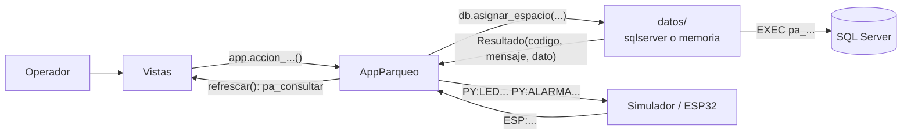

# Sistema Inteligente de Parqueo

Aplicación de escritorio (Python + Tkinter) conectada a SQL Server que administra
los espacios de un parqueo: registra vehículos, les asigna un espacio compatible,
controla su ciclo de entrada y salida, activa alarmas de seguridad y está
preparada para integrarse con sensores (ESP32).

Proyecto final del curso **Autómatas y Lenguajes Formales** · Ingeniería en
Sistemas · Universidad Mariano Gálvez.

> **Estado del proyecto:** el software (base de datos, capa de datos, lógica e
> interfaz) está implementado y probado. La **integración con el hardware real
> (ESP32) todavía no existe**: hoy se simula desde la propia aplicación. Ver
> [Estado y limitaciones](#estado-y-limitaciones).

---

## Qué hace

- **Registrar vehículos** por placa y tipo (compacto, grande, motocicleta, carga, reservado).
- **Asignar espacio automáticamente.** La base de datos elige el espacio según
  una tabla de compatibilidad con prioridades (por ejemplo, un compacto puede
  usar un espacio grande si no quedan compactos).
- **Controlar el ciclo completo de una ocupación:**
  `asignada → ocupada → autorizada → finalizada`.
- **Seguridad y alarmas.** Al llegar el vehículo se activa la seguridad; un
  movimiento no autorizado o una salida sin autorización dispara una alarma que
  indica qué vehículo la causa.
- **Mapa visual de espacios** con el color del estado y un LED virtual que
  imita al LED físico de cada espacio.
- **Consola de comandos** del lenguaje del proyecto, con bitácora de cada
  instrucción (error léxico, sintáctico, semántico o de ejecución).
- **Simulador de sensores** que reproduce los mensajes que enviará el ESP32.
- **Resistente a fallos de conexión:** si SQL Server deja de responder, la
  aplicación no se cierra y se reconecta sola.

---

## Requisitos

| Requisito | Detalle |
|---|---|
| Sistema operativo | Windows (la interfaz usa las fuentes Segoe UI y Consolas) |
| Python | **3.10 o superior** (probado con 3.14). Debe incluir Tkinter; el instalador de python.org lo trae |
| SQL Server | 2019 o superior (probado con SQL Server 2025 Developer) |
| Driver ODBC | **ODBC Driver 18 for SQL Server** (el 17 también sirve, ver [Configuración](#configuración)) |
| Dependencias de Python | `pyodbc` (se instala con `requirements.txt`) |

**Sin SQL Server** también puedes abrir la aplicación en *modo demostración*
(datos de ejemplo en memoria). Ver [Modo demostración](#modo-demostración).

---

## Instalación

### 1. Descargar el proyecto

```bash
git clone https://github.com/JuanMayens5/sistema-inteligente-parqueo.git
```

```bash
cd sistema-inteligente-parqueo
```

### 2. Instalar la dependencia

```bash
pip install -r requirements.txt
```

### 3. Crear la base de datos

> ⚠️ **`database.sql` borra y vuelve a crear todas las tablas.** Ejecútalo solo
> en una base que no tenga datos que quieras conservar.

Con `sqlcmd` (la opción `-f 65001` es obligatoria: el archivo está en UTF-8 y sin
ella los mensajes con acentos se dañan):

```bash
sqlcmd -S localhost -E -C -f 65001 -i database.sql
```

También puedes abrir `database.sql` en SQL Server Management Studio y ejecutarlo.

El script crea la base `SistemaInteligenteParqueo` con:

- 9 tablas y 2 vistas,
- 8 procedimientos almacenados (uno por cada comando del lenguaje),
- datos iniciales: 5 tipos de vehículo, 5 tipos de espacio, la compatibilidad
  entre ellos y 9 espacios (`C-01`..`C-03`, `G-01`, `G-02`, `M-01`, `M-02`, `CD-01`, `R-01`).

### 4. Configurar la conexión

Copia la plantilla (si no existe `config_db.ini`):

```bash
copy config_db.ejemplo.ini config_db.ini
```

Edítalo si tu SQL Server no es la instancia local con tu usuario de Windows.
Ver [Configuración](#configuración).

### 5. Comprobar que todo está bien

```bash
python herramientas/verificar_conexion.py
```

Revisa el driver, la conexión, los catálogos, los procedimientos y los acentos, y
dice exactamente qué falla. No modifica nada.

### 6. Abrir la aplicación

```bash
python main.py
```

---

## Configuración

Archivo `config_db.ini` (no se sube al repositorio porque puede llevar contraseñas):

```ini
[datos]
origen = sqlserver          ; sqlserver | mock

[sqlserver]
driver = ODBC Driver 18 for SQL Server
servidor = localhost        ; ej. localhost, .\SQLEXPRESS, 192.168.1.10
base_datos = SistemaInteligenteParqueo
autenticacion = windows     ; windows | sql
usuario =
contrasena =

[operacion]
operador = CONTROL          ; se guarda en autorizado_por / apagada_por
refresco_ms = 3000          ; cada cuánto se relee el estado del parqueo
```

| Quiero... | Cambio |
|---|---|
| Usar SQL Server Express | `servidor = .\SQLEXPRESS` |
| Entrar con usuario y contraseña de SQL Server | `autenticacion = sql` y `usuario = ...` |
| No escribir la contraseña en el archivo | Definir la variable de entorno `PARQUEO_DB_CONTRASENA` (tiene prioridad) |
| Usar el Driver 17 | `driver = ODBC Driver 17 for SQL Server` |
| Cambiar el nombre que queda en la base al autorizar | `operador = TU_NOMBRE` |
| Forzar el modo demostración | `origen = mock`, o la variable de entorno `PARQUEO_ORIGEN=mock` |

### Modo demostración

Con `origen = mock` (o aceptando abrirla así cuando no hay conexión) la
aplicación funciona con datos de ejemplo guardados en memoria: no necesita SQL
Server ni `pyodbc`. Sirve para conocer la interfaz. Los cambios se pierden al
cerrarla. El menú **⋯ Más acciones → Reiniciar datos de demostración** restaura
los datos de ejemplo.

---

## Guía de uso

### Modo Operación (pantalla principal)

- **Barra de acción rápida:** escribe la placa, elige el tipo y usa el **botón
  azul**, que siempre ofrece el siguiente paso según el estado del vehículo:

  | Estado del vehículo | Texto del botón |
  |---|---|
  | No registrado | Registrar y asignar espacio |
  | Registrado, sin espacio | Asignar espacio |
  | Espacio asignado | Registrar llegada |
  | Ocupado, con alarma | **Apagar alarma** (botón rojo) |
  | Ocupado | Autorizar salida |
  | Salida autorizada | Registrar salida |

  `Enter` en el campo de placa ejecuta ese botón.
- **Mapa de espacios:** clic en una tarjeta para ver su ficha y operar sobre
  ese vehículo.

  | Color | Significado |
  |---|---|
  | Verde | Disponible |
  | Amarillo | Asignado (esperando al vehículo) |
  | Rojo | Ocupado |
  | Azul | Saliendo (salida autorizada) |
  | Gris | Fuera de servicio |

  El punto de cada tarjeta muestra el LED físico; con **borde rojo
  parpadeante y ⚠** el espacio tiene una alarma activa.
- **Aviso rojo sobre el mapa:** aparece cuando hay alarmas, con los botones
  *Ver* y *Apagar alarma*.
- **Indicadores del encabezado:** disponibles, asignados, ocupados y alarmas.
- **🔔 y "Ver todas":** historial de notificaciones de la sesión.
- **⋯ Más acciones:** registrar sin asignar, buscar un vehículo, actualizar,
  limpiar campos.

### Modo Avanzado (botón ⚙ del encabezado)

- **Detalle:** una tabla con selector: vehículos en el parqueo, catálogo de
  espacios, vehículos registrados, alarmas activas, historial de ocupaciones,
  eventos de sensor y bitácora de comandos.
- **Consola del lenguaje:** escribe `AYUDA` para ver los comandos. Ejemplos:

  ```
  REGISTRAR P123ABC COMPACTO
  ASIGNAR P123ABC
  LLEGADA P123ABC
  MOVIMIENTO C-01
  APAGAR_ALARMA P123ABC
  AUTORIZAR_SALIDA P123ABC
  SALIDA P123ABC
  CONSULTAR
  ```

  Cada instrucción queda registrada en la bitácora con su resultado.
- **Simulador de sensores:** elige un espacio y dispara lo que reportaría el
  hardware (llegó un vehículo, se fue, movimiento, botón de salida). Muestra los
  mensajes `ESP:...` recibidos y los comandos `PY:...` que se le responderían al ESP32.

### Escenario de prueba completo (alarma)

1. Registra `P123ABC` y asígnale espacio (botón azul).
2. Registra su llegada → la seguridad queda armada.
3. En el simulador, envía **Movimiento (PIR)** → alarma activa.
4. **Apagar alarma** → la seguridad sigue armada.
5. Envía **Se fue el vehículo** → alarma por salida no autorizada.
6. **Autorizar salida** y luego **Registrar salida** → el espacio queda libre.

---

## Estructura del proyecto

```
├── main.py                  Punto de entrada: config → origen de datos → ventana
├── database.sql             Base de datos: tablas, vistas y procedimientos (pa_*)
├── config_db.ejemplo.ini    Plantilla de configuración (copiar como config_db.ini)
├── requirements.txt         Dependencias (pyodbc)
│
├── datos/                   CAPA DE DATOS: lo único que habla con la base
│   ├── __init__.py          Lee la configuración y elige el origen de datos
│   ├── contrato.py          Lo que comparten los dos orígenes (Resultado, estados...)
│   ├── sqlserver.py         Origen real: llama a los procedimientos con pyodbc
│   └── memoria.py           Modo demostración: imita a la base en memoria
│
├── logica/                  Lógica sin interfaz ni SQL
│   ├── mensajes.py          Códigos de resultado → textos en español y colores
│   ├── interprete.py        Consola del lenguaje + bitácora
│   └── eventos_hardware.py  Mensajes del ESP32 ↔ procedimientos y comandos de LEDs
│
├── interfaz/                Interfaz gráfica (Tkinter)
│   ├── app.py               Ventana principal y controlador (todas las acciones)
│   ├── vista_operacion.py   Modo Operación
│   ├── vista_avanzada.py    Modo Avanzado
│   └── componentes.py       Colores, estilos y piezas reutilizables
│
├── herramientas/            verificar_conexion.py · reiniciar_base.py
├── pruebas/                 prueba_backend.py · prueba_interfaz.py
└── docs/                    Documentación del proyecto
```

### Cómo funciona



Tres reglas del diseño:

1. **Las reglas de negocio viven en la base de datos.** Python no decide qué
   espacio asignar ni cuándo suena una alarma: llama al procedimiento
   almacenado y muestra lo que responde.
2. **Solo la capa `datos/` habla con la base**, y solo la ventana principal
   habla con `datos/`.
3. **Dos orígenes de datos con el mismo contrato:** SQL Server y memoria. Se
   elige en `config_db.ini` sin tocar código.

---

## Pruebas

```bash
python pruebas/prueba_backend.py
```

```bash
python pruebas/prueba_interfaz.py --sqlserver
```

- `prueba_backend.py`: cada procedimiento, la consola con su bitácora y los
  eventos de sensores. Corre los **mismos casos** contra SQL Server y contra
  memoria (38 casos cada uno).
- `prueba_interfaz.py`: abre la ventana real y la maneja por código. Sin
  `--sqlserver` usa el modo demostración.

Las pruebas con SQL Server usan una base aparte, `SistemaInteligenteParqueo_Pruebas`,
que se crea y reinicia sola: **tu base de desarrollo no se toca**. Para reiniciar
una base a mano:

```bash
python herramientas/reiniciar_base.py --base SistemaInteligenteParqueo_Pruebas
```

---

## Solución de problemas

| Síntoma | Causa probable y solución |
|---|---|
| `No module named 'pyodbc'` | `pip install -r requirements.txt` |
| `Data source name not found` / driver no encontrado | Instala el ODBC Driver 18, o pon `driver = ODBC Driver 17 for SQL Server` |
| `Login failed` | Con `autenticacion = windows` solo entra tu usuario de Windows. Usa `autenticacion = sql` con usuario y contraseña |
| `Cannot open database` | No ejecutaste `database.sql`, o `base_datos` está mal escrito |
| El servidor no responde | Comprueba que el servicio de SQL Server esté en ejecución y el nombre de `servidor` (instancias con nombre: `.\NOMBRE`) |
| Los mensajes salen con símbolos raros | Ejecutaste `database.sql` sin `-f 65001`. Vuélvelo a ejecutar con esa opción |
| Aparece "No se pudo conectar" al abrir | Acepta el modo demostración, o revisa con `python herramientas/verificar_conexion.py` |
| `SyntaxError` en `eventos_hardware.py` | Tu Python es anterior a 3.10 |

---

## Estado y limitaciones

**Implementado y probado:** base de datos, capa de datos (SQL Server y modo
demostración), consola con bitácora, interfaz completa (modos Operación y
Avanzado), simulador de sensores y reconexión automática.

**Pendiente:**

- **Hardware real.** No existe el programa del ESP32 ni el puente por puerto
  serial. El protocolo de mensajes (`ESP:ESPACIO:C-01:OCUPADO`,
  `PY:LED:C-01:ROJO`...) es una propuesta pendiente de acordar con el equipo de
  hardware. Ver [docs/PLAN_INTEGRACION_HARDWARE.md](docs/PLAN_INTEGRACION_HARDWARE.md).
- **Liberar un espacio manualmente.** La base no tiene `pa_cancelar_ocupacion`,
  por lo que ese botón no aparece con SQL Server (solo en modo demostración).
- **Analizador léxico/sintáctico definitivo.** La consola usa uno provisional.
- **Mejoras propuestas a la base de datos** (expiración de asignaciones,
  alarma de sensor inconsistente, espacios fuera de servicio, vista ampliada):
  ver [docs/PLAN_INTEGRACION_BASE_DATOS.md](docs/PLAN_INTEGRACION_BASE_DATOS.md).

---

## Documentación

| Documento | Contenido |
|---|---|
| [docs/DOCUMENTACION_TECNICA.md](docs/DOCUMENTACION_TECNICA.md) | Cómo funciona el código, flujos y cómo hacer cambios comunes |
| [docs/PLAN_INTEGRACION_BASE_DATOS.md](docs/PLAN_INTEGRACION_BASE_DATOS.md) | Análisis de `database.sql` y plan de integración |
| [docs/PLAN_INTEGRACION_HARDWARE.md](docs/PLAN_INTEGRACION_HARDWARE.md) | Protocolo con el ESP32 y lo que falta para el hardware |

Para entender el código, empieza por `main.py` y luego por `interfaz/app.py`:
cada archivo explica en su encabezado qué hace y cómo encaja.
