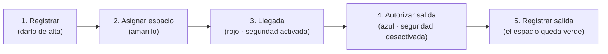
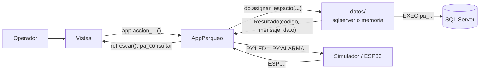

# Sistema Inteligente de Parqueo

Aplicación de escritorio (Python + Tkinter) conectada a SQL Server que administra
los espacios de un parqueo: registra vehículos, les asigna un espacio compatible,
controla su ciclo de entrada y salida, activa alarmas de seguridad y está
preparada para integrarse con sensores (ESP32).

Proyecto final del curso **Autómatas y Lenguajes Formales** · Ingeniería en
Sistemas · Universidad Mariano Gálvez.

> **Estado del proyecto:** el software (base de datos, capa de datos, lógica e
> interfaz) está implementado y probado. La **integración con el hardware real
> (ESP32) todavía no existe**: hoy se simula desde la propia aplicación. Ver
> [Estado y limitaciones](#estado-y-limitaciones).

## Índice

| Si quieres... | Ve a |
|---|---|
| Saber qué hace la aplicación | [Qué hace](#qué-hace) |
| Instalarla y abrirla | [Requisitos](#requisitos) · [Instalación](#instalación) · [Configuración](#configuración) |
| **Aprender a usarla** (sin saber programar) | **[Manual de usuario](#manual-de-usuario)** |
| Entender el código | [Estructura del proyecto](#estructura-del-proyecto) · [Documentación](#documentación) |
| Verificar que funciona | [Pruebas](#pruebas) · [docs/GUIA_DE_VALIDACION.md](docs/GUIA_DE_VALIDACION.md) |
| Resolver un problema | [Solución de problemas](#solución-de-problemas) |

---

## Qué hace

- **Registrar vehículos** por placa y tipo (compacto, grande, motocicleta, carga, reservado).
- **Asignar espacio automáticamente.** La base de datos elige el espacio según
  una tabla de compatibilidad con prioridades (por ejemplo, un compacto puede
  usar un espacio grande si no quedan compactos).
- **Controlar el ciclo completo de una ocupación:**
  `asignada → ocupada → autorizada → finalizada`.
- **Seguridad y alarmas.** Al llegar el vehículo se activa la seguridad; un
  movimiento no autorizado o una salida sin autorización dispara una alarma que
  indica qué vehículo la causa.
- **Mapa visual de espacios** con el color del estado y un LED virtual que
  imita al LED físico de cada espacio.
- **Consola de comandos** del lenguaje del proyecto, con bitácora de cada
  instrucción (error léxico, sintáctico, semántico o de ejecución).
- **Simulador de sensores** que reproduce los mensajes que enviará el ESP32.
- **Resistente a fallos de conexión:** si SQL Server deja de responder, la
  aplicación no se cierra y se reconecta sola.

---

## Requisitos

| Requisito | Detalle |
|---|---|
| Sistema operativo | Windows (la interfaz usa las fuentes Segoe UI y Consolas) |
| Python | **3.10 o superior** (probado con 3.14). Debe incluir Tkinter; el instalador de python.org lo trae |
| SQL Server | 2019 o superior (probado con SQL Server 2025 Developer) |
| Driver ODBC | **ODBC Driver 18 for SQL Server** (el 17 también sirve, ver [Configuración](#configuración)) |
| Dependencias de Python | `pyodbc` (se instala con `requirements.txt`) |

**Sin SQL Server** también puedes abrir la aplicación en *modo demostración*
(datos de ejemplo en memoria). Ver [Modo demostración](#modo-demostración).

---

## Instalación

### 1. Descargar el proyecto

```bash
git clone https://github.com/JuanMayens5/sistema-inteligente-parqueo.git
```

```bash
cd sistema-inteligente-parqueo
```

### 2. Instalar la dependencia

```bash
pip install -r requirements.txt
```

### 3. Crear la base de datos

> ⚠️ **`database.sql` borra y vuelve a crear todas las tablas.** Ejecútalo solo
> en una base que no tenga datos que quieras conservar.

Con `sqlcmd` (la opción `-f 65001` es obligatoria: el archivo está en UTF-8 y sin
ella los mensajes con acentos se dañan):

```bash
sqlcmd -S localhost -E -C -f 65001 -i database.sql
```

También puedes abrir `database.sql` en SQL Server Management Studio y ejecutarlo.

El script crea la base `SistemaInteligenteParqueo` con:

- 9 tablas y 2 vistas,
- 8 procedimientos almacenados (uno por cada comando del lenguaje),
- datos iniciales: 5 tipos de vehículo, 5 tipos de espacio, la compatibilidad
  entre ellos y 9 espacios (`C-01`..`C-03`, `G-01`, `G-02`, `M-01`, `M-02`, `CD-01`, `R-01`).

### 4. Configurar la conexión

> 📌 **`config_db.ini` es el único archivo que debes editar** para conectar la
> aplicación a TU SQL Server (servidor, usuario, nombre de la base). No hay
> que cambiar nada en el código. Este archivo no viene en el repositorio:
> lo creas tú copiando la plantilla.

Copia la plantilla (si no existe `config_db.ini`):

```bash
copy config_db.ejemplo.ini config_db.ini
```

Edítalo si tu SQL Server no es la instancia local con tu usuario de Windows
(otra instancia, otro servidor, usuario y contraseña de SQL Server, etc.).
Ver [Configuración](#configuración).

### 5. Comprobar que todo está bien

```bash
python herramientas/verificar_conexion.py
```

Revisa el driver, la conexión, los catálogos, los procedimientos y los acentos, y
dice exactamente qué falla. No modifica nada.

### 6. Abrir la aplicación

```bash
python main.py
```

---

## Configuración

Archivo `config_db.ini` (no se sube al repositorio porque puede llevar contraseñas):

```ini
[datos]
origen = sqlserver          ; sqlserver | mock

[sqlserver]
driver = ODBC Driver 18 for SQL Server
servidor = localhost        ; ej. localhost, .\SQLEXPRESS, 192.168.1.10
base_datos = SistemaInteligenteParqueo
autenticacion = windows     ; windows | sql
usuario =
contrasena =

[operacion]
operador = CONTROL          ; se guarda en autorizado_por / apagada_por
refresco_ms = 3000          ; cada cuánto se relee el estado del parqueo
```

| Quiero... | Cambio |
|---|---|
| Usar SQL Server Express | `servidor = .\SQLEXPRESS` |
| Entrar con usuario y contraseña de SQL Server | `autenticacion = sql` y `usuario = ...` |
| No escribir la contraseña en el archivo | Definir la variable de entorno `PARQUEO_DB_CONTRASENA` (tiene prioridad) |
| Usar el Driver 17 | `driver = ODBC Driver 17 for SQL Server` |
| Cambiar el nombre que queda en la base al autorizar | `operador = TU_NOMBRE` |
| Forzar el modo demostración | `origen = mock`, o la variable de entorno `PARQUEO_ORIGEN=mock` |

### Modo demostración

Con `origen = mock` (o aceptando abrirla así cuando no hay conexión) la
aplicación funciona con datos de ejemplo guardados en memoria: no necesita SQL
Server ni `pyodbc`. Sirve para conocer la interfaz. Los cambios se pierden al
cerrarla. El menú **⋯ Más acciones → Reiniciar datos de demostración** restaura
los datos de ejemplo.

---

## Manual de usuario

Esta sección explica cómo usar la aplicación una vez instalada. No hace falta
saber programar ni SQL.

### Conceptos básicos

| Palabra | Qué significa |
|---|---|
| **Espacio** | Un lugar del parqueo (`C-01`, `G-02`, `M-01`...). Cada uno es de un tipo: compacto, grande, motocicleta, carga y descarga o reservado |
| **Vehículo** | Se identifica por su **placa** (hasta 20 caracteres; la aplicación la pasa a mayúsculas) y su **tipo** |
| **Asignación** | La aplicación le **reserva** un espacio a un vehículo antes de que llegue |
| **Ocupación** | El recorrido de un vehículo por un espacio, de que se le asigna hasta que sale |
| **Seguridad** | Se **activa sola** cuando el vehículo llega y se **desactiva** cuando el operador autoriza su salida |
| **Alarma** | Se dispara si hay movimiento en un espacio con la seguridad activa, o si un vehículo sale sin autorización. Siempre indica **qué vehículo** la causó |
| **LED** | Cada espacio tiene un LED físico (en el futuro, con el hardware). En pantalla se ve como un puntito de color en la tarjeta |
| **Operador** | Quien usa la aplicación. Su nombre (`operador` en `config_db.ini`) queda guardado al autorizar salidas o apagar alarmas |

**¿Qué espacio recibe cada tipo de vehículo?** Lo decide la base de datos, no la
aplicación. Elige el mejor espacio libre y, si no hay, una alternativa:

| Vehículo | Primera opción | Si no hay |
|---|---|---|
| Compacto | Espacio compacto | Espacio grande |
| Grande | Espacio grande | — |
| Motocicleta | Espacio de motocicleta | Espacio compacto |
| Carga | Espacio de carga y descarga | — |
| Reservado | Espacio reservado | — |

### El ciclo de un vehículo

Todo vehículo pasa por las mismas etapas, siempre en este orden:



**No tienes que recordarlo:** el botón azul de la pantalla siempre te ofrece el
paso que sigue.

### La pantalla principal

Al abrir la aplicación ves el **modo Operación**:

```
┌─────────────────────────────────────────────────────────────────────────────┐
│ Sistema Inteligente de Parqueo     ⚙ Modo avanzado 🔔  [9][0][0][0]      │ ① Encabezado
├─────────────────────────────────────────────────────────────────────────────┤
│ Placa [_______]  Tipo [______▾]  [ Botón azul ]  [Liberar]  [⋯ Más acciones]│ ② Barra de acción
├─────────────────────────────────────────────────────────────────────────────┤
│ ⚠ C-01 · Movimiento no autorizado...              [Ver] [Apagar alarma]     │ ③ Aviso (solo si hay alarma)
├─────────────────────────────────────────────────────────────────────────────┤
│  COMPACTO · 2 de 3 disponibles        GRANDE · 2 de 2 disponibles           │
│  [C-01] [C-02] [C-03]                 [G-01] [G-02]                         │ ④ Mapa de espacios
├─────────────────────────────────────────────────────────────────────────────┤
│ ✓ Última notificación                                       [Ver todas ▾]   │ ⑤ Notificaciones
└─────────────────────────────────────────────────────────────────────────────┘
```

1. **Encabezado.** Cuatro contadores: **Disponibles**, **Asignados**,
   **Ocupados** y **Alarmas** (se pone rojo si hay alguna). **⚙ Modo avanzado**
   cambia de pantalla; **🔔** abre el historial de notificaciones.
2. **Barra de acción.** Aquí se escribe la placa, se elige el tipo y se usa el
   botón azul.
3. **Aviso de alarma.** Solo aparece cuando hay una alarma activa.
4. **Mapa de espacios.** Una tarjeta por espacio, agrupadas por tipo.
5. **Notificaciones.** Muestra el último mensaje. **Ver todas** abre el historial.

Si dejas el mouse quieto sobre cualquier botón, indicador o tarjeta, aparece una
explicación breve.

### Los colores del mapa

| Color | Significa | LED |
|---|---|---|
| 🟩 Verde | **Disponible** | verde |
| 🟨 Amarillo | **Asignado**: reservado, el vehículo aún no llega | amarillo |
| 🟥 Rojo | **Ocupado**: el vehículo está dentro | rojo |
| 🟦 Azul | **Saliendo**: su salida ya fue autorizada | amarillo |
| ⬜ Gris | **Fuera de servicio** | apagado |
| Borde rojo parpadeante con ⚠ | **Alarma** en ese espacio | rojo intermitente |

### El botón azul: siempre el siguiente paso

Escribe la placa y mira qué dice el botón. Cambia solo según el estado del vehículo:

| Si el vehículo... | El botón dice | Qué hace |
|---|---|---|
| No está registrado (o el campo está vacío) | **Registrar y asignar espacio** | Lo da de alta y le reserva un espacio |
| Está registrado pero sin espacio | **Asignar espacio** | Le reserva un espacio |
| Tiene espacio asignado y aún no llega | **Registrar llegada** | Confirma que llegó y activa la seguridad |
| Está dentro del parqueo | **Autorizar salida** | Permite que se vaya y desactiva la seguridad |
| Está dentro y hay una alarma | **Apagar alarma** (botón **rojo**) | Silencia la alarma |
| Su salida está autorizada | **Registrar salida** | Libera el espacio |

`Enter` en el campo de placa hace lo mismo que el botón. Si eliges una tarjeta
ocupada en el mapa, su placa se escribe sola en el campo.

### Tareas paso a paso

#### Recibir un vehículo nuevo
1. Escribe la placa (por ejemplo `P123ABC`).
2. Elige el **tipo** de vehículo.
3. Pulsa **Registrar y asignar espacio**.
4. La aplicación avisa qué espacio le tocó (ejemplo: `C-01`) y esa tarjeta se pone **amarilla**.

> Si solo quieres darlo de alta sin asignarle espacio todavía, usa
> **⋯ Más acciones → Solo registrar**.

#### Cuando el vehículo llega a su espacio
1. Escribe la placa (o haz clic en su tarjeta amarilla).
2. Pulsa **Registrar llegada**.
3. La tarjeta se pone **roja** y la **seguridad queda activada**.

#### Cuando el vehículo se va
1. Con la placa escrita, pulsa **Autorizar salida**. La tarjeta se pone **azul**.
2. Cuando se retire, pulsa **Registrar salida**.
3. El espacio queda **verde** y disponible.

> ⚠ **Autoriza la salida antes de que el vehículo se vaya.** Si se va sin
> autorización, se dispara una alarma.

#### Buscar un vehículo o ver un espacio
- **Un vehículo:** escribe su placa y elige **⋯ Más acciones → Buscar vehículo por placa**.
- **Un espacio:** haz clic en su tarjeta.

En ambos casos se abre un **panel de información** en la esquina derecha, con
el estado, las horas de asignación y llegada, quién autorizó la salida, si la
seguridad está activa y si hay alarma. Se cierra con **×**.

#### Revisar lo que pasó
Pulsa **🔔** o **Ver todas** para ver el historial de notificaciones de la sesión.
Cada acción deja un mensaje con su hora, en verde (correcto), ámbar (aviso),
rojo (error) o azul (informativo).

### Qué hacer cuando suena una alarma

Una alarma significa que **algo pasó en un espacio con un vehículo que no tiene
salida autorizada**. La aplicación avisa de tres formas a la vez: suena la
campana del sistema, aparece una **franja roja** sobre el mapa y la tarjeta
parpadea con ⚠. El contador de **Alarmas** del encabezado se pone rojo.

La franja dice **qué espacio** y **qué vehículo** la causó. Cómo resolverla:

1. Pulsa **Ver** en la franja para abrir el espacio afectado, o haz clic en la tarjeta que parpadea.
2. Comprueba qué ocurrió (¿el vehículo realmente se mueve? ¿alguien intenta sacarlo?).
3. Elige:
   - **Apagar alarma** (franja o botón rojo): silencia la alarma, pero **la seguridad sigue activa**: si vuelve a haber movimiento, sonará otra vez.
   - **Autorizar salida**: si el vehículo sí debe irse. Cierra la alarma y desactiva la seguridad.

Hay dos causas de alarma:

| Causa | Cuándo ocurre |
|---|---|
| Movimiento no autorizado | Se detecta movimiento en un espacio ocupado cuya salida no está autorizada |
| Salida no autorizada | Se intenta registrar la salida de un vehículo sin haberla autorizado |

Si se detecta movimiento **después** de autorizar la salida, no hay alarma.

### Modo Avanzado

Pulsa **⚙ Modo avanzado** para ver las herramientas técnicas, y **← Volver a
operación** para regresar. Tiene tres pestañas.

#### Detalle
Una tabla con un selector **"Mostrar"** que cambia lo que ves:

| Vista | Para qué sirve |
|---|---|
| Vehículos en el parqueo | Quién está dentro, en qué espacio y en qué etapa |
| Catálogo de espacios | Todos los espacios con su sector, estado, LED y alarma |
| Vehículos registrados | Todos los vehículos dados de alta |
| Alarmas activas | Las alarmas sonando ahora y qué vehículo las causa |
| Historial de ocupaciones | Todas las ocupaciones, incluidas las finalizadas |
| Eventos de sensor | Lo que han reportado los sensores (llegadas, salidas, movimientos) |
| Bitácora de comandos | Todo lo escrito en la consola y cómo terminó |

Al hacer clic en una fila se abre su ficha en el panel de información.

#### Consola del lenguaje
Permite escribir **comandos** en vez de usar botones. Escribe `AYUDA` para ver la lista.

| Comando | Qué hace |
|---|---|
| `REGISTRAR P123ABC COMPACTO` | Registra un vehículo (**placa primero, tipo después**) |
| `ASIGNAR P123ABC` | Le asigna un espacio |
| `LLEGADA P123ABC` | Confirma su llegada |
| `MOVIMIENTO C-01` | Simula el sensor de movimiento en un espacio |
| `APAGAR_ALARMA P123ABC` | Apaga la alarma del vehículo |
| `AUTORIZAR_SALIDA P123ABC` | Autoriza su salida |
| `SALIDA P123ABC` | Registra su salida |
| `ESTADO` | Resumen del parqueo |
| `CONSULTAR` / `CONSULTAR OCUPADOS` | Tabla de espacios (completa o filtrada) |
| `VEHICULOS` · `ALARMAS` | Lista de vehículos / de alarmas activas |
| `BUSCAR P123ABC` | Ficha de un vehículo |
| `TOKENS REGISTRAR P1 X` | Muestra cómo el analizador divide un texto |
| `LIMPIAR` | Borra la consola |

Los tipos válidos son `COMPACTO`, `GRANDE`, `MOTOCICLETA`, `CARGA` y
`RESERVADO`. La flecha **↑** recupera comandos anteriores. El `;` final es opcional.

**Cada instrucción queda guardada en la bitácora** con el resultado:

| Resultado | Significa | Ejemplo |
|---|---|---|
| `OK` | Se ejecutó | `REGISTRAR P123ABC COMPACTO` |
| `ERROR_LEXICO` | Hay un carácter que no se reconoce | `REGISTRAR P123ABC #` |
| `ERROR_SINTACTICO` | Comando desconocido o faltan datos | `ASIGNAR` (sin placa) |
| `ERROR_SEMANTICO` | Está bien escrito pero la base lo rechazó | `ASIGNAR P999ZZZ` (no existe) |

> La sintaxis de esta consola es **provisional**: el analizador definitivo del
> curso la reemplazará.

#### Simulador de sensores
El hardware real (ESP32) todavía no está conectado. Este simulador reproduce lo
que **haría**, para probar el sistema completo. Elige un **espacio** y pulsa:

| Botón | Qué simula |
|---|---|
| 🚗 Llegó un vehículo | El sensor de ultrasonido detecta un vehículo (confirma su llegada si estaba asignado) |
| ↩ Se fue el vehículo | El sensor deja de detectarlo (registra su salida; sin autorización, hay alarma) |
| 👁 Movimiento (PIR) | El sensor de movimiento detecta actividad |
| 🔘 Botón físico de salida | El operador presiona el botón de autorización |

A la derecha, el registro muestra los mensajes que **recibiría** el ESP32
(`→ ESP:...`) y las órdenes que se le **enviarían** para sus LEDs y su alarma
(`← PY:LED:C-01:ROJO`, `← PY:ALARMA:ON`). **Reenviar estado completo** repite
todas las órdenes, como si el ESP32 se hubiera reiniciado.

### Ejemplo completo: de la llegada a la alarma

1. Escribe `P123ABC`, elige **COMPACTO** y pulsa **Registrar y asignar espacio** → `C-01` amarillo.
2. Pulsa **Registrar llegada** → `C-01` rojo, seguridad activada.
3. **⚙ Modo avanzado → Simulador**, elige **C-01** y pulsa **Movimiento (PIR)** → alarma.
4. Vuelve a operación: franja roja con el espacio y la placa. Pulsa **Apagar alarma**.
5. En el simulador, pulsa **Se fue el vehículo** → nueva alarma, por salida no autorizada.
6. Pulsa **Autorizar salida** → `C-01` azul, sin alarmas.
7. Pulsa **Registrar salida** → `C-01` verde y libre.

### Mensajes frecuentes

| Mensaje | Qué significa y qué hacer |
|---|---|
| "Debes ingresar la placa del vehículo" | El campo de placa está vacío |
| "La placa no puede tener más de 20 caracteres" | Escribe una placa más corta |
| "La placa X ya estaba registrada" | Ese vehículo ya existe; el botón azul ofrece su siguiente paso |
| "No hay espacios disponibles para vehículos tipo X" | Ya no queda ningún espacio compatible. Espera a que se libere uno |
| "El vehículo X no tiene una asignación pendiente de llegada" | Ya registró su llegada, o nunca se le asignó espacio |
| "La salida de X no estaba autorizada: se activó una alarma" | Se intentó la salida sin autorizar. Autorízala y vuelve a registrarla |
| "Quedan solo N espacios disponibles" / "Parqueo lleno" | Aviso de capacidad |
| "Se perdió la conexión con la base de datos" | Ver la pregunta de abajo |

### Preguntas frecuentes

**¿Se pierden los datos al cerrar la aplicación?**
No. Todo se guarda en SQL Server. Solo se pierde en el *modo demostración*, que usa datos de ejemplo en memoria.

**¿Qué pasa si se cae la conexión con la base de datos?**
La aplicación no se cierra. Los controles se desactivan, el indicador de abajo
se pone rojo y reintenta conectarse cada pocos segundos. Al volver la conexión,
todo se reactiva solo y avisa "Conexión recuperada".

**¿Puedo tener dos ventanas abiertas?**
Sí. Lo que se haga en una aparece en la otra en unos segundos.

**¿Un vehículo puede entrar otra vez después de salir?**
Sí. Sigue registrado: el botón azul mostrará **Asignar espacio** y empieza un
ciclo nuevo. El anterior queda en el historial.

**¿Por qué no veo el botón "Liberar espacio"?**
La base de datos todavía no tiene el procedimiento para cancelar una ocupación
a mano. Cuando se agregue, el botón aparece solo. Mientras tanto, un vehículo
que no llega no se puede quitar desde la aplicación.

**¿El botón azul cambió y no sé por qué?**
Cambia según la placa que está escrita: busca a ese vehículo y ofrece lo que
sigue. Si no es el que querías, revisa la placa o pulsa **⋯ Más acciones → Limpiar campos**.

**¿Dónde veo qué hizo cada persona?**
En **Modo Avanzado → Detalle**: *Bitácora de comandos* (consola), *Historial de
ocupaciones* (incluye quién autorizó cada salida) y *Eventos de sensor*.

---

## Estructura del proyecto

```
├── main.py                  Punto de entrada: config → origen de datos → ventana
├── database.sql             Base de datos: tablas, vistas y procedimientos (pa_*)
├── config_db.ejemplo.ini    Plantilla de configuración (copiar como config_db.ini)
├── requirements.txt         Dependencias (pyodbc)
│
├── datos/                   CAPA DE DATOS: lo único que habla con la base
│   ├── __init__.py          Lee la configuración y elige el origen de datos
│   ├── contrato.py          Lo que comparten los dos orígenes (Resultado, estados...)
│   ├── sqlserver.py         Origen real: llama a los procedimientos con pyodbc
│   └── memoria.py           Modo demostración: imita a la base en memoria
│
├── logica/                  Lógica sin interfaz ni SQL
│   ├── mensajes.py          Códigos de resultado → textos en español y colores
│   ├── interprete.py        Consola del lenguaje + bitácora
│   └── eventos_hardware.py  Mensajes del ESP32 ↔ procedimientos y comandos de LEDs
│
├── interfaz/                Interfaz gráfica (Tkinter)
│   ├── app.py               Ventana principal y controlador (todas las acciones)
│   ├── vista_operacion.py   Modo Operación
│   ├── vista_avanzada.py    Modo Avanzado
│   └── componentes.py       Colores, estilos y piezas reutilizables
│
├── herramientas/            verificar_conexion.py · reiniciar_base.py
├── pruebas/                 prueba_backend.py · prueba_interfaz.py
└── docs/                    Documentación del proyecto
```

### Cómo funciona



Tres reglas del diseño:

1. **Las reglas de negocio viven en la base de datos.** Python no decide qué
   espacio asignar ni cuándo suena una alarma: llama al procedimiento
   almacenado y muestra lo que responde.
2. **Solo la capa `datos/` habla con la base**, y solo la ventana principal
   habla con `datos/`.
3. **Dos orígenes de datos con el mismo contrato:** SQL Server y memoria. Se
   elige en `config_db.ini` sin tocar código.

---

## Pruebas

```bash
python pruebas/prueba_backend.py
```

```bash
python pruebas/prueba_interfaz.py --sqlserver
```

- `prueba_backend.py`: cada procedimiento, la consola con su bitácora y los
  eventos de sensores. Corre los **mismos casos** contra SQL Server y contra
  memoria (38 casos cada uno).
- `prueba_interfaz.py`: abre la ventana real y la maneja por código. Sin
  `--sqlserver` usa el modo demostración.

Las pruebas con SQL Server usan una base aparte, `SistemaInteligenteParqueo_Pruebas`,
que se crea y reinicia sola: **tu base de desarrollo no se toca**. Para reiniciar
una base a mano:

```bash
python herramientas/reiniciar_base.py --base SistemaInteligenteParqueo_Pruebas
```

---

## Solución de problemas

| Síntoma | Causa probable y solución |
|---|---|
| `No module named 'pyodbc'` | `pip install -r requirements.txt` |
| `Data source name not found` / driver no encontrado | Instala el ODBC Driver 18, o pon `driver = ODBC Driver 17 for SQL Server` |
| `Login failed` | Con `autenticacion = windows` solo entra tu usuario de Windows. Usa `autenticacion = sql` con usuario y contraseña |
| `Cannot open database` | No ejecutaste `database.sql`, o `base_datos` está mal escrito |
| El servidor no responde | Comprueba que el servicio de SQL Server esté en ejecución y el nombre de `servidor` (instancias con nombre: `.\NOMBRE`) |
| Los mensajes salen con símbolos raros | Ejecutaste `database.sql` sin `-f 65001`. Vuélvelo a ejecutar con esa opción |
| Aparece "No se pudo conectar" al abrir | Acepta el modo demostración, o revisa con `python herramientas/verificar_conexion.py` |
| `SyntaxError` en `eventos_hardware.py` | Tu Python es anterior a 3.10 |

---

## Estado y limitaciones

**Implementado y probado:** base de datos, capa de datos (SQL Server y modo
demostración), consola con bitácora, interfaz completa (modos Operación y
Avanzado), simulador de sensores y reconexión automática.

**Pendiente:**

- **Hardware real.** No existe el programa del ESP32 ni el puente por puerto
  serial. El protocolo de mensajes (`ESP:ESPACIO:C-01:OCUPADO`,
  `PY:LED:C-01:ROJO`...) es una propuesta pendiente de acordar con el equipo de
  hardware. Ver [docs/PLAN_INTEGRACION_HARDWARE.md](docs/PLAN_INTEGRACION_HARDWARE.md).
- **Liberar un espacio manualmente.** La base no tiene `pa_cancelar_ocupacion`,
  por lo que ese botón no aparece con SQL Server (solo en modo demostración).
- **Analizador léxico/sintáctico definitivo.** La consola usa uno provisional.
- **Mejoras propuestas a la base de datos** (expiración de asignaciones,
  alarma de sensor inconsistente, espacios fuera de servicio, vista ampliada):
  ver [docs/PLAN_INTEGRACION_BASE_DATOS.md](docs/PLAN_INTEGRACION_BASE_DATOS.md).

---

## Documentación

| Documento | Contenido |
|---|---|
| [docs/DOCUMENTACION_TECNICA.md](docs/DOCUMENTACION_TECNICA.md) | Cómo funciona el código, flujos y cómo hacer cambios comunes |
| [docs/PLAN_INTEGRACION_BASE_DATOS.md](docs/PLAN_INTEGRACION_BASE_DATOS.md) | Análisis de `database.sql` y plan de integración |
| [docs/PLAN_INTEGRACION_HARDWARE.md](docs/PLAN_INTEGRACION_HARDWARE.md) | Protocolo con el ESP32 y lo que falta para el hardware |
| [docs/GUIA_DE_VALIDACION.md](docs/GUIA_DE_VALIDACION.md) | Lista de pasos para comprobar que todo funciona antes de entregar |

Para entender el código, empieza por `main.py` y luego por `interfaz/app.py`:
cada archivo explica en su encabezado qué hace y cómo encaja.
