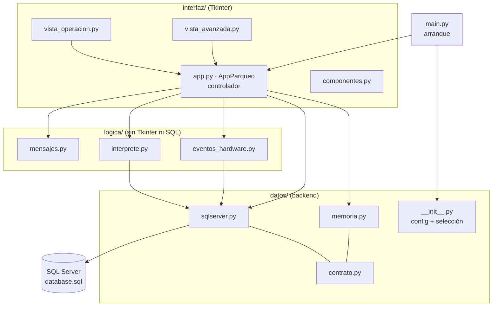
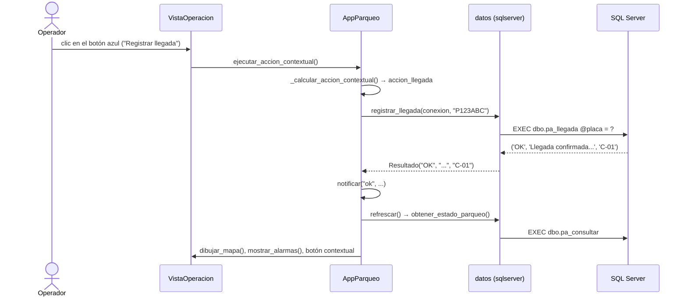
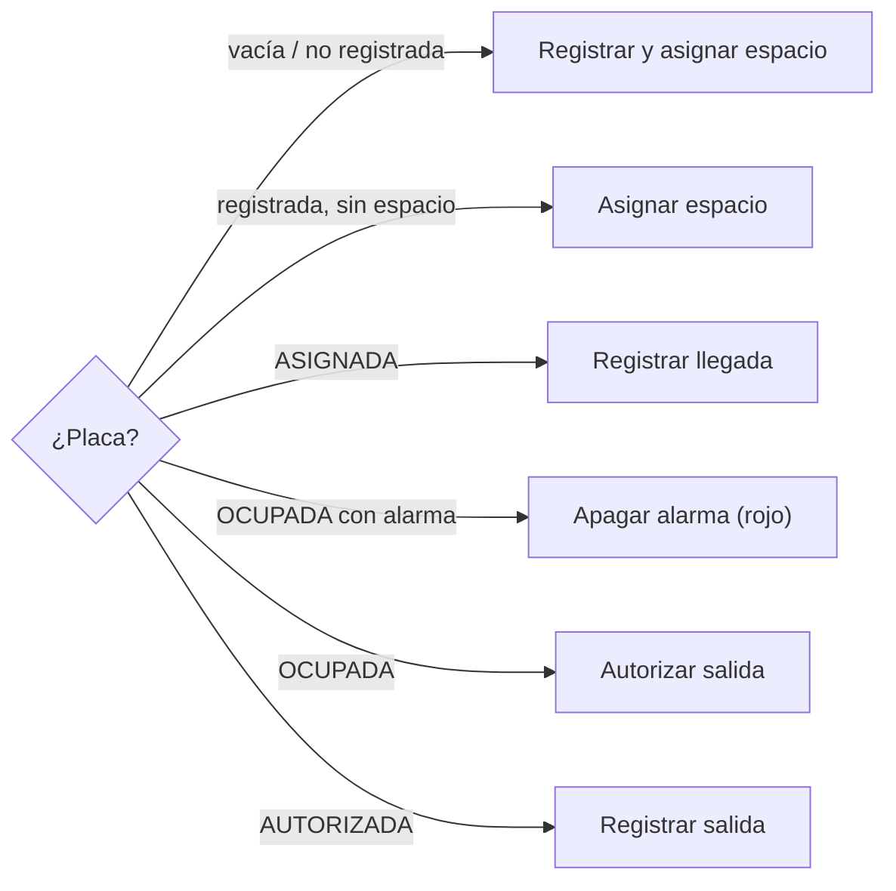

# Documentación técnica — Sistema Inteligente de Parqueo

Guía para entender y modificar el código. Para instalar y ejecutar, ver el
[README](../README.md). Cada archivo `.py` también explica en su encabezado qué
hace y cómo encaja; este documento da la vista de conjunto.

## 1. Arquitectura en capas

Tres reglas sostienen la estructura:

1. **Solo `datos/` habla con la base**, y solo `AppParqueo` habla con `datos/`.
   Las vistas reciben los datos ya leídos y, cuando el usuario hace algo, llaman
   a `self.app.accion_...()`.
2. **Las reglas de negocio viven en la base** (procedimientos `pa_*`). Python no
   decide qué espacio asignar ni cuándo sonar una alarma: llama al procedimiento
   y muestra lo que responde.
3. **Dos orígenes de datos, un mismo contrato.** `datos/sqlserver.py` y
   `datos/memoria.py` tienen las mismas funciones y devuelven lo mismo
   (`datos/contrato.py`). Se elige uno en `config_db.ini`; el resto del programa
   no sabe cuál está usando.

## 2. Recorrido por los archivos

### `main.py`
Lee la configuración, elige el origen de datos, abre la conexión y crea la
ventana. Si SQL Server no responde, ofrece el modo demostración.

### `datos/`
| Archivo | Responsabilidad |
|---|---|
| `__init__.py` | `Configuracion` (valores de `config_db.ini`), `cargar_configuracion()`, `obtener_backend(origen)` |
| `contrato.py` | `Resultado(codigo, mensaje, dato)`, `ErrorConexion`, constantes de estados, `resumir()`, `fila_de_espacio()`, `fila_de_placa()`. Su encabezado lista **todas** las funciones del contrato |
| `sqlserver.py` | `ConexionSQL` (abre, reconecta y convierte errores de pyodbc en `ErrorConexion`). Una función por procedimiento (`asignar_espacio` → `pa_asignar_espacio`...) y las lecturas con `SELECT` parametrizados |
| `memoria.py` | `BaseEnMemoria` (las tablas como listas). Una función por procedimiento que imita su lógica con los mismos códigos y mensajes. Trae datos de ejemplo con un vehículo en cada etapa del ciclo |

### `logica/`
| Archivo | Responsabilidad |
|---|---|
| `mensajes.py` | `MENSAJES` (código → texto en español), `NIVELES` (código → color), `describir()`, `nivel()`, `fue_procesado()` |
| `interprete.py` | Consola: `tokenizar()` (fase léxica), validación de comando y argumentos (fase sintáctica), llamada a la base (fase semántica) y registro en `bitacora_comandos`. Los comandos están en dos tablas: `ACCIONES` (escriben) y `CONSULTAS` (leen) |
| `eventos_hardware.py` | `interpretar_mensaje()` ("ESP:..." → evento), `procesar_evento()` (evento → procedimiento) y `SincronizadorEsp32` (estado de la base → comandos "PY:...") |

### `interfaz/`
| Archivo | Responsabilidad |
|---|---|
| `app.py` | `AppParqueo`: construye la ventana, guarda el estado, refresca, maneja la conexión y contiene **todas las acciones** del operador |
| `vista_operacion.py` | `VistaOperacion`: barra de acción rápida, aviso de alarma, mapa (tarjetas con color de estado y LED virtual), última notificación |
| `vista_avanzada.py` | `VistaAvanzada`: pestaña Detalle (una tabla, 7 vistas configuradas en `VISTAS_DETALLE`), Consola y Simulador de sensores |
| `componentes.py` | Paleta (`ESTILO_ESTADO`, `COLOR_LED`...), `configurar_estilos()`, `ToolTip`, `crear_tabla()`, `PanelInformacion`, `VentanaNotificaciones` |

## 3. Flujos principales

### 3.1 Acción del operador (ejemplo: "Registrar llegada")

Todas las acciones siguen el mismo patrón: **llamar a la base → notificar con
el texto de `mensajes.py` → `refrescar()`**. Las de una sola placa (llegada,
autorizar, salida, apagar alarma) comparten `_accion_con_placa()`.

### 3.2 Refresco

`refrescar()` hace **una** consulta (`pa_consultar`) y reparte esa copia al
encabezado, al mapa, al aviso de alarma, al botón contextual, al panel de
información, a la pestaña Detalle y al `SincronizadorEsp32`. Solo redibuja si
el estado cambió, para que el mapa no parpadee. Se llama después de cada
acción y cada `refresco_ms` (por si otra ventana, la consola o el hardware
cambiaron algo).

### 3.3 Botón contextual

Un solo botón ofrece el siguiente paso según el estado del vehículo cuya
placa está escrita (`_calcular_accion_contextual`):

Para no consultar la base en cada tecla, espera 300 ms después de la última
(`al_cambiar_placa`).

### 3.4 Consola del lenguaje

`VistaAvanzada` → `AppParqueo.ejecutar_comando(texto)` →
`interprete.ejecutar(texto, db, conexion, operador)`:

1. `tokenizar()`: si hay un carácter desconocido → `ERROR_LEXICO`.
2. Busca el comando en `ACCIONES` o `CONSULTAS` y revisa la cantidad de
   argumentos → `ERROR_SINTACTICO` si falla.
3. Llama a la base; si la rechaza → `ERROR_SEMANTICO`.
4. Guarda la instrucción en `bitacora_comandos` con su clasificación.

### 3.5 Evento de sensor (simulador hoy, ESP32 después)

`AppParqueo.procesar_mensaje_esp32("ESP:ESPACIO:C-01:OCUPADO")` →
`eventos_hardware.interpretar_mensaje()` → `procesar_evento()` (busca la placa
asignada a C-01 y llama a `pa_llegada`) → `refrescar()`, donde
`SincronizadorEsp32` calcula `PY:LED:C-01:ROJO`. Detalle completo en
[PLAN_INTEGRACION_HARDWARE.md](PLAN_INTEGRACION_HARDWARE.md).

### 3.6 Pérdida de conexión

Las acciones no tienen `try/except` propios. Si SQL Server deja de responder,
`ConexionSQL` lanza `ErrorConexion`; Tkinter la entrega a
`AppParqueo.report_callback_exception()`, que deshabilita los controles de
escritura y pone el indicador inferior en rojo. `_refresco_periodico()`
intenta `conexion.reconectar()` en cada ciclo y, al lograrlo, todo vuelve a
la normalidad sin cerrar la aplicación.

## 4. Estados y colores

| Estado de la ocupación | Tarjeta | LED (`led_estado`) | Lo pone |
|---|---|---|---|
| (sin ocupación) | verde "Disponible" | VERDE | `pa_salida` |
| ASIGNADA | amarillo "Asignado" | AMARILLO | `pa_asignar_espacio` |
| OCUPADA | rojo "Ocupado" | ROJO | `pa_llegada` |
| OCUPADA + alarma | borde rojo parpadeante, ⚠ | PARPADEO | `pa_registrar_movimiento`, `pa_salida` sin autorizar |
| AUTORIZADA | azul "Saliendo" | AMARILLO | `pa_autorizar_salida` |
| espacio FUERA_DE_SERVICIO | gris | APAGADO | (sin procedimiento todavía) |

La tarjeta usa el estado de la **ocupación** (`componentes.estado_visual`)
porque distingue "Ocupado" de "Saliendo"; el punto de color muestra
literalmente el `led_estado` de la base.

## 5. Cómo hacer cambios comunes

| Quiero... | Dónde |
|---|---|
| Cambiar entre SQL Server y modo demostración | `config_db.ini` → `origen = sqlserver` o `mock` |
| Usar otro servidor, base o usuario | `config_db.ini`, sección `[sqlserver]` (la contraseña, mejor en la variable de entorno `PARQUEO_DB_CONTRASENA`) |
| Cambiar un texto que ve el usuario | `logica/mensajes.py` (`MENSAJES`) |
| Mostrar bien un código nuevo que devuelve la base | Agregarlo a `MENSAJES` y `NIVELES` en `logica/mensajes.py` (si no, se muestra el mensaje de la base) |
| Usar un procedimiento nuevo de la base | 1) función en `datos/sqlserver.py` con `_procedimiento(...)`; 2) la misma función en `datos/memoria.py`; 3) agregarla a la lista del encabezado de `datos/contrato.py`; 4) un caso en `pruebas/prueba_backend.py` |
| Agregar un comando a la consola | `logica/interprete.py`: una entrada en `ACCIONES` (si escribe) o una función en `CONSULTAS` (si lee), y una línea en `AYUDA` |
| Agregar una vista a la pestaña Detalle | `interfaz/vista_avanzada.py`: una entrada en `VISTAS_DETALLE` |
| Cambiar colores o tamaños | Constantes al inicio de `interfaz/componentes.py` y de `interfaz/vista_operacion.py` |
| Agregar una acción al modo Operación | Método `accion_...` en `interfaz/app.py` y un botón o entrada de menú en `interfaz/vista_operacion.py` que lo llame |
| Conectar el hardware real | Ver [PLAN_INTEGRACION_HARDWARE.md](PLAN_INTEGRACION_HARDWARE.md), sección 2.3 |

## 6. Pruebas

| Script | Qué cubre | Casos |
|---|---|---|
| `pruebas/prueba_backend.py` | Cada procedimiento, la consola con su bitácora, los eventos de sensores y la sincronización de LEDs. Corre **los mismos casos** contra SQL Server y contra memoria (paridad) | BD-01..BD-23, CO-01..07, EV-01..07, CA |
| `pruebas/prueba_interfaz.py` | La ventana real manejada por código: ciclo con el botón contextual, alarmas, simulador, consola, todas las vistas de detalle, cambios desde otra conexión y pérdida/recuperación de la conexión | UI-01..UI-10 |
| `herramientas/verificar_conexion.py` | Driver, conexión, catálogos, procedimientos y acentos (solo lectura) | — |

Las pruebas con SQL Server crean y reinician `SistemaInteligenteParqueo_Pruebas`
con `herramientas/reiniciar_base.py`; la base de desarrollo nunca se toca.

## 7. Pendientes conocidos

| Tema | Situación |
|---|---|
| Liberar un espacio a mano | Falta `pa_cancelar_ocupacion` en la base (propuesta en el Anexo A del plan de integración). La interfaz muestra el botón "Liberar espacio" automáticamente cuando el procedimiento exista; el modo demostración ya lo implementa |
| Sensor de ocupación sin vehículo asignado | Se avisa como "ocupación no esperada". Lo ideal es un `pa_evento_ocupacion` en la base que genere la alarma `SENSOR_INCONSISTENTE` |
| Analizador léxico/sintáctico definitivo | `logica/interprete.py` es provisional; el definitivo debe conservar la función `ejecutar()`. La sintaxis oficial está por definirse |
| Hardware real | Falta `hardware_serial.py` (plan de hardware, sección 2) |
| Espacios fuera de servicio | La interfaz ya los dibuja en gris, pero la base no tiene un procedimiento para marcarlos |
