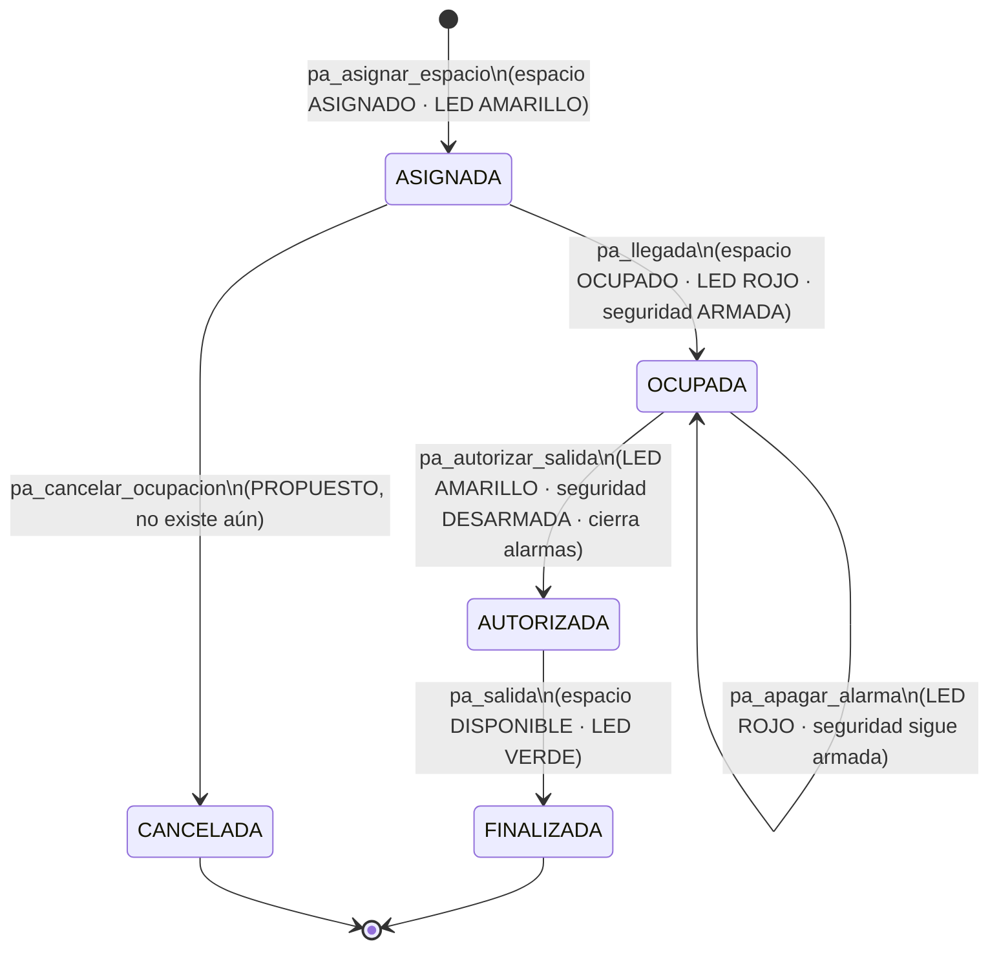
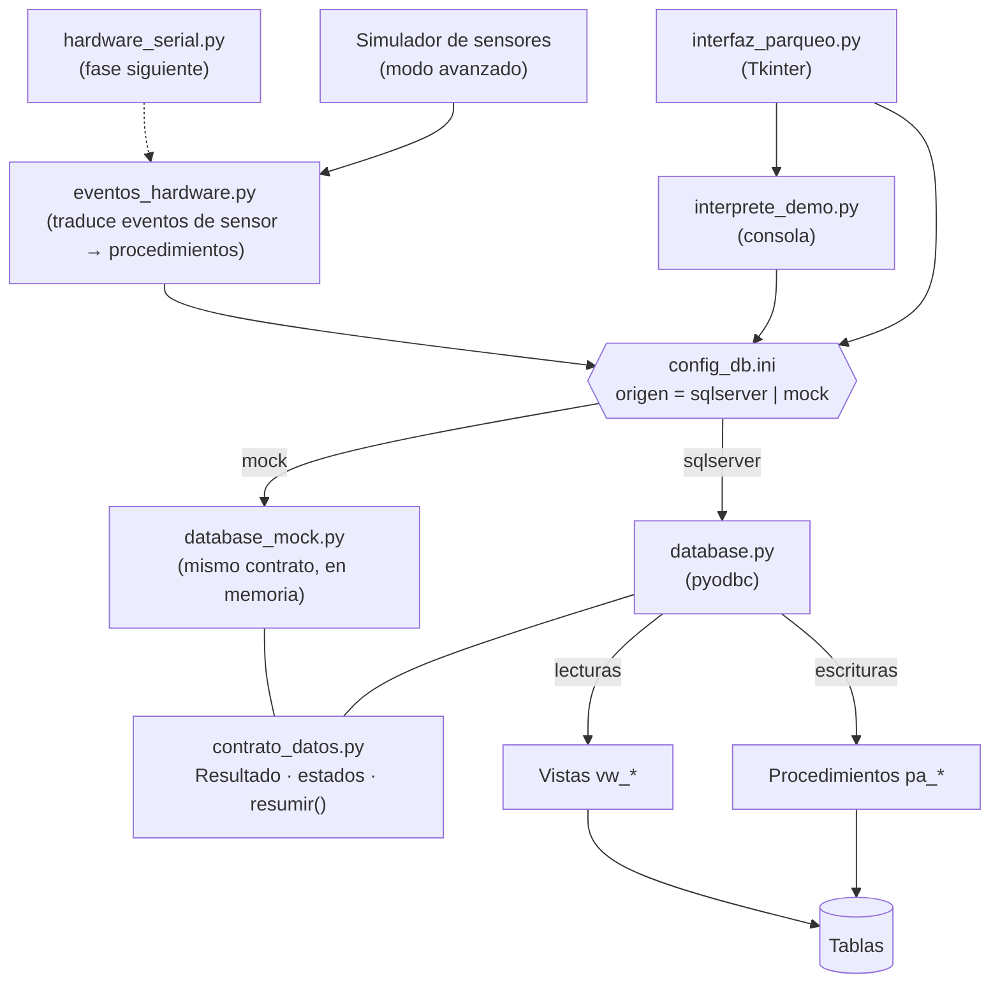
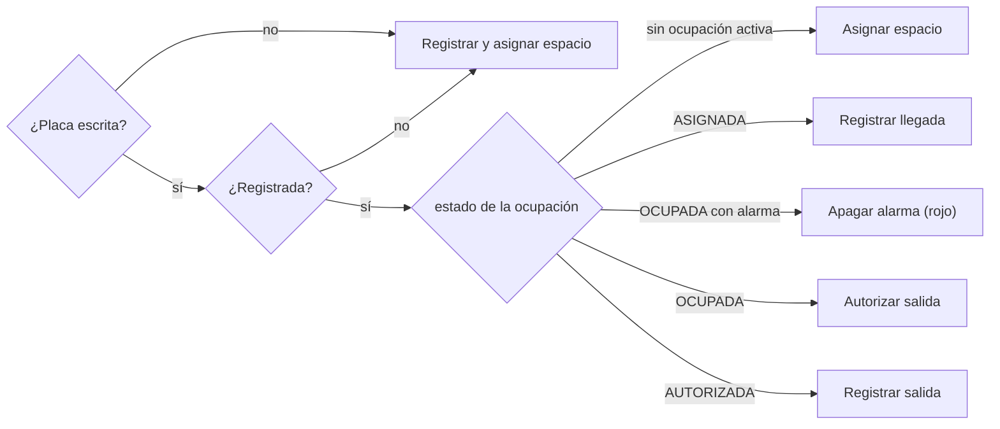
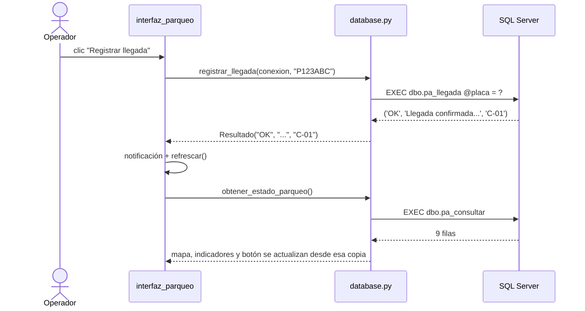
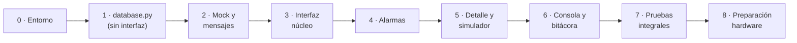

# Plan de implementación — Integración de la base de datos con la interfaz

Sistema Inteligente de Parqueo · Autómatas y Lenguajes Formales · UMG

> **Estado: implementado (etapas 0 a 8).** Todas las pruebas pasan contra SQL
> Server y contra el modo demostración: 38 casos de backend y 10 de interfaz
> en cada uno. Diferencias con lo planeado:
>
> | Plan | Implementación | Motivo |
> |---|---|---|
> | `database.py`, `database_mock.py` | `datos/sqlserver.py`, `datos/memoria.py` | Código organizado en paquetes (`datos/`, `logica/`, `interfaz/`) |
> | `contrato_datos.py`, `configuracion` | `datos/contrato.py`, `datos/__init__.py` | Viven junto a la capa de datos |
> | `interprete_demo.py`, `mensajes.py` | `logica/interprete.py`, `logica/mensajes.py` | Lógica separada de la interfaz |
> | `interfaz_parqueo.py` (un archivo) | `interfaz/app.py`, `vista_operacion.py`, `vista_avanzada.py`, `componentes.py` | El archivo único superaba las 900 líneas |
> | `pruebas/prueba_integracion_db.py` | `pruebas/prueba_backend.py` y `pruebas/prueba_interfaz.py` | El backend también prueba la consola y los eventos de hardware |
> | Sensor ocupado sin asignación → `PY:LED:...:PARPADEO` | Solo un aviso "ocupación no esperada" | El LED se calcula desde la base; un parpadeo enviado a mano se borraría en la siguiente sincronización |
> | `PY:ALARMA` y `PY:LED_ALARMA` | Solo `PY:ALARMA` (buzzer y LED de alarma juntos) | Protocolo más simple |
>
> La guía del código está en [DOCUMENTACION_TECNICA.md](DOCUMENTACION_TECNICA.md).

Este documento analiza el estado actual de la aplicación y del script final
`database.sql`, identifica las diferencias entre ambos, y define paso a paso
cómo conectar la interfaz a SQL Server, qué se quita, qué se agrega, cómo se
prueba, y cómo queda todo listo para conectar el hardware (ESP32) después.

## Resumen

- La base de datos **ya está desplegada** en la instancia local de SQL Server
  y es accesible desde Python (verificado, ver 1.3). Lo que falta es la capa
  `database.py`, que hoy está vacía.
- El script nuevo es **más rico que el modelo que usa la interfaz hoy**:
  4 estados de espacio (antes 2), ciclo de vida explícito de la ocupación,
  compatibilidad con prioridades, alarmas de seguridad, eventos de sensor,
  estado de LEDs y bitácora de comandos. La interfaz actual no conoce nada de
  eso, así que la integración no es "cambiar una línea de import": hay que
  **ajustar el contrato** entre interfaz y datos.
- La regla de oro que se mantiene: **toda la lógica de negocio vive en los
  procedimientos almacenados**. Python solo los llama y muestra el resultado.
  Las escrituras van siempre por procedimiento; las lecturas por vistas o
  `SELECT` parametrizados.
- Se agrega un **simulador de sensores** en el modo avanzado que dispara los
  mismos procedimientos que usará el ESP32. Así el flujo completo de hardware
  queda validado contra la base real **antes** de tener el hardware armado.
- El trabajo se divide en 8 etapas (sección 8), cada una con entregable y
  criterio de aceptación, empezando por la capa de datos sin interfaz para
  aislar errores.

---

## 1. Estado actual de la aplicación

### 1.1 Arquitectura vigente

| Archivo | Rol actual |
|---|---|
| `main.py` | Punto de entrada, llama a `interfaz_parqueo.main()`. |
| `interfaz_parqueo.py` | Interfaz Tkinter: modo Operación (mapa, acción rápida, botón contextual) y modo Avanzado (tablas de detalle + consola). |
| `database_mock.py` | Capa de datos **simulada en memoria** (14 espacios, 2 estados). Es la que usa la interfaz hoy. |
| `database.py` | **Vacío (0 bytes).** Aquí va la capa real. |
| `mensajes.py` | Traduce códigos de resultado a texto en español y nivel de color. |
| `interprete_demo.py` | Intérprete provisional de la consola (`REGISTRAR`, `ASIGNAR`, `ESTADO`...). |
| `database.sql` | Script final: tablas, vistas, procedimientos y datos iniciales. |

### 1.2 Contrato actual entre interfaz y datos

La interfaz importa `database_mock as db` y usa estas funciones:

`conectar_db`, `registrar_vehiculo` (lanza excepción si la placa se repite),
`asignar_espacio` (devuelve el código del espacio o un código de error),
`registrar_llegada`, `autorizar_salida`, `registrar_salida`,
`liberar_espacio`, `listar_espacios`, `listar_vehiculos`,
`listar_ocupaciones`, `buscar_vehiculo`, `resumen`, más la constante
`TIPOS_VEHICULO` y `reiniciar_datos_demo` (solo del mock).

### 1.3 Entorno verificado

Revisado directamente en la máquina de desarrollo, con consultas de solo lectura:

| Elemento | Estado | Detalle |
|---|---|---|
| SQL Server | ✅ Corriendo | SQL Server 2025 Developer, instancia por defecto `MSSQLSERVER` en `localhost`. |
| Base `SistemaInteligenteParqueo` | ✅ Desplegada | 9 tablas, 2 vistas, 8 procedimientos, 9 espacios cargados. Tablas transaccionales vacías (0 vehículos, 0 ocupaciones). |
| Autenticación de Windows | ✅ Funciona | Conexión sin usuario/contraseña (`Trusted_Connection=yes`). |
| Drivers ODBC | ✅ Instalados | `ODBC Driver 17` y `ODBC Driver 18 for SQL Server`. |
| `sqlcmd` | ✅ Disponible | Útil para reiniciar la base en pruebas. |
| Python | ✅ 3.14.7 | — |
| `pyodbc` | ❌ No instalado | Existe wheel oficial `pyodbc 5.3.0` para Python 3.14 / Windows (no requiere compilador). |
| Conexión desde Python | ✅ Probada | `pyodbc` + Driver 18 + `TrustServerCertificate=yes`: conecta, lee catálogos y ejecuta `pa_consultar`. |
| Acentos | ✅ Correctos | Collation `SQL_Latin1_General_CP1_CI_AS`; los textos llegan bien a Python sin configuración extra. |
| `database.sql` | ⚠️ UTF-8 sin BOM | Si se ejecuta con `sqlcmd` hay que usar `-f 65001`, o los acentos de los mensajes se corrompen. |

---

## 2. Análisis de `database.sql`

### 2.1 Qué aporta el script

- **Catálogos como datos, no como código**: `tipos_vehiculo`, `tipos_espacio`
  y `compatibilidad` con prioridad (ej. un compacto puede usar un espacio
  grande si no hay compactos; una moto puede usar un compacto).
- **Espacios con 4 estados**: `DISPONIBLE`, `ASIGNADO` (reservado, el vehículo
  aún no llega), `OCUPADO` (llegada confirmada), `FUERA_DE_SERVICIO`.
- **Datos de electrónica por espacio**: `direccion_hw` (pin del ESP32),
  `led_estado` (`VERDE`, `AMARILLO`, `ROJO`, `PARPADEO`, `APAGADO`),
  `sensor_ocupacion`, `sensor_movimiento`, `sector`.
- **Ocupación con ciclo de vida completo** (ver 2.2), con `seguridad_activa`
  y `autorizado_por`.
- **Alarmas** ligadas a la ocupación (siempre se sabe qué vehículo la causa).
- **Eventos de sensor** (historial crudo) y **bitácora de comandos** (cada
  instrucción del lenguaje y en qué fase falló).
- **Integridad garantizada por el motor**, no por Python: índices únicos
  filtrados (un espacio no puede tener dos ocupaciones vivas, un vehículo no
  puede estar en dos espacios, una sola alarma activa por espacio), `CHECK`
  de estados y `UPDLOCK` en la asignación para evitar que dos operadores
  tomen el mismo espacio.
- **Un procedimiento por comando del lenguaje**, todos con la misma forma de
  respuesta: una fila `(resultado, mensaje[, dato])`.

### 2.2 Ciclo de vida de una ocupación



### 2.3 Procedimientos disponibles

| Comando | Procedimiento | Parámetros | Códigos que devuelve | Dato extra |
|---|---|---|---|---|
| REGISTRAR | `pa_registrar_vehiculo` | `@placa`, `@tipo` | `OK`, `TIPO_INVALIDO`, `YA_REGISTRADO` | — |
| ASIGNAR | `pa_asignar_espacio` | `@placa` | `OK`, `VEHICULO_NO_ENCONTRADO`, `YA_TIENE_ESPACIO`, `SIN_ESPACIO` | `codigo_espacio` |
| LLEGADA | `pa_llegada` | `@placa` | `OK`, `SIN_ASIGNACION` | `codigo_espacio` |
| (sensor PIR) | `pa_registrar_movimiento` | `@codigo_espacio` | `ALARMA_ACTIVADA`, `ALARMA_YA_ACTIVA`, `MOVIMIENTO_AUTORIZADO`, `ESPACIO_NO_ENCONTRADO` | `placa` |
| APAGAR_ALARMA | `pa_apagar_alarma` | `@placa`, `@usuario` | `OK`, `SIN_ALARMA` | — |
| AUTORIZAR_SALIDA | `pa_autorizar_salida` | `@placa`, `@operador` | `OK`, `SIN_OCUPACION` | — |
| SALIDA | `pa_salida` | `@placa` | `OK`, `SIN_OCUPACION`, `SALIDA_NO_AUTORIZADA` (genera alarma) | `codigo_espacio` |
| CONSULTAR | `pa_consultar` | — | filas de `vw_estado_parqueo` | — |

### 2.4 Vistas

| Vista | Qué devuelve | Uso en la interfaz |
|---|---|---|
| `vw_estado_parqueo` | Una fila por espacio: `espacio, tipo, sector, estado, led_estado, placa_vehiculo, tipo_vehiculo, estado_ocupacion, fecha_asignacion, fecha_llegada, alarma_activa` (columnas verificadas) | Fuente única del mapa, los indicadores del encabezado y el botón contextual. |
| `vw_alarmas_activas` | Alarmas activas con espacio, placa, tipo, fecha y descripción | Banner de alarmas, indicador de alarmas, detalle "Alarmas activas". |

---

## 3. Brechas entre la aplicación actual y la base de datos

### 3.1 Diferencias de modelo

| Concepto | Interfaz / mock actual | Base de datos real | Impacto |
|---|---|---|---|
| Estados de espacio | `DISPONIBLE`, `OCUPADO` | + `ASIGNADO`, `FUERA_DE_SERVICIO` | Mapa y colores deben soportar 4 estados. |
| Estado de la ocupación | Implícito: `fecha_llegada` + booleano `salida_autorizada` | Columna `estado`: `ASIGNADA → OCUPADA → AUTORIZADA → FINALIZADA / CANCELADA` | El botón contextual debe basarse en `estado_ocupacion`. |
| Tipos de vehículo | Constante en Python, incluye `CARGA_DESCARGA` | Tabla: `CARGA` (no `CARGA_DESCARGA`), `COMPACTO`, `GRANDE`, `MOTOCICLETA`, `RESERVADO` | Cargar el combo desde la base; si se deja la constante, registrar un vehículo de carga fallaría con `TIPO_INVALIDO`. |
| Qué tipos reciben espacio | Solo compacto, grande y moto (`TIPO_NO_ASIGNABLE` para el resto) | **Todos**, según la tabla `compatibilidad` | Desaparece `TIPO_NO_ASIGNABLE` y el tooltip que lo explica. |
| Regla de asignación | Mismo tipo exacto | Compatibilidad con prioridad (compacto → grande, moto → compacto) | La interfaz no decide nada, solo muestra el espacio devuelto. |
| Placa duplicada | Excepción de Python con texto `UNIQUE` | Código `YA_REGISTRADO` (sin excepción) | Cambiar `_accion_registrar`. |
| Forma de respuesta | Mezcla: excepción, `"OK"`, código de espacio o código de error | Siempre una fila `(resultado, mensaje, dato)` | Unificar en un tipo `Resultado` (ver 4.2). |
| Alarmas / seguridad | No existen | Tabla `alarmas`, `seguridad_activa`, LED `PARPADEO` | Funcionalidad nueva en la interfaz (sección 5). |
| LEDs | No existen | `led_estado` por espacio | "LED virtual" en cada tarjeta del mapa. |
| Espacios | 14 generados en memoria | 9 reales (`C-01..03`, `G-01..02`, `M-01..02`, `CD-01`, `R-01`) con sector y pin | El mapa se arma solo con lo que devuelve la base. |
| Operador | No existe | `@operador` / `@usuario` en autorizar y apagar alarma | Tomarlo de la configuración. |
| Bitácora de comandos | No existe | Tabla `bitacora_comandos` | La consola debe registrar cada instrucción. |

### 3.2 Funciones que la interfaz necesita y la base no cubre con un procedimiento

| Función de la interfaz | Situación | Cómo se resuelve |
|---|---|---|
| `liberar_espacio` (liberación manual) | **No hay procedimiento.** El estado `CANCELADA` existe en el `CHECK` pero ningún procedimiento lo usa. | Proponer `pa_cancelar_ocupacion` al encargado de la base (borrador en el Anexo A). Mientras no exista, el botón "Liberar espacio" se oculta. **No** se implementa con `UPDATE` desde Python para no romper la regla de "escrituras solo por procedimiento". |
| `buscar_vehiculo` | Sin procedimiento, pero es solo lectura. | `SELECT` parametrizado (vehículo + ocupación activa + alarma). |
| `listar_vehiculos`, `listar_ocupaciones` | Solo lectura. | `SELECT` parametrizados. |
| `resumen` (indicadores) | Solo lectura. | Se calcula en Python a partir de `pa_consultar` (una sola consulta por refresco). |
| Registro en bitácora | Sin procedimiento. | `INSERT` parametrizado directo (tabla de solo inserción). Opcional: `pa_registrar_bitacora`. |
| Reiniciar datos | No aplica en producción. | Solo para pruebas: volver a ejecutar `database.sql` (es re-ejecutable, ver 9.3). |

### 3.3 Observaciones y recomendaciones para el script

Ninguna bloquea la integración; son mejoras para coordinar con el encargado
de la base de datos.

| Prioridad | Observación | Recomendación |
|---|---|---|
| Alta | No existe forma de cancelar/liberar una ocupación (estado `CANCELADA` sin uso). | Agregar `pa_cancelar_ocupacion` (Anexo A). |
| Media | `pa_llegada` recibe **placa**, pero el sensor ultrasónico solo sabe **qué espacio** se ocupó. | Para la fase de hardware, agregar `pa_evento_ocupacion(@codigo_espacio, @valor)` que decida internamente: llegada, salida, o alarma `SENSOR_INCONSISTENTE` (tipo de alarma que hoy tampoco se usa). |
| Media | `pa_apagar_alarma` busca la alarma por placa a través de la ocupación: una alarma sin ocupación (`ocupacion_id` NULL) no se podría apagar. | Aceptar también `@codigo_espacio`. |
| Baja | `SIN_OCUPACION` significa cosas distintas en `pa_autorizar_salida` ("todavía no llegó" o "ya estaba autorizada") y en `pa_salida` ("no está dentro"). | Códigos distintos, o que la interfaz muestre el `mensaje` que devuelve la base en esos casos (es lo que se propone en 7). |
| Baja | La rama "salida no autorizada" de `pa_salida` hace `INSERT` + `UPDATE` sin transacción explícita. | Envolverla en `BEGIN TRAN / COMMIT` como el resto. |
| Baja | `vw_estado_parqueo` no expone `seguridad_activa`, `fecha_autorizacion`, `direccion_hw` ni `activo`. | Agregarlas a la vista (útil para el panel de detalle y para el hardware) o consultarlas aparte. |
| Baja | No hay procedimiento para poner un espacio `FUERA_DE_SERVICIO`. | Opcional: `pa_cambiar_estado_espacio`. |
| Baja | El nombre de la base está fijo en el script. | Parametrizar con una variable de `sqlcmd` para poder tener una base de pruebas separada. |

---

## 4. Arquitectura objetivo



Principios:

1. **Escrituras solo por procedimiento almacenado.** Nunca `INSERT/UPDATE`
   de negocio desde Python (la única excepción es la bitácora, que es de
   solo inserción).
2. **Lecturas por vista o `SELECT` parametrizado** (con `?`, nunca armando
   el SQL con concatenación de texto).
3. **Una sola conexión, usada solo desde el hilo principal de Tkinter.**
   `pyodbc` no es seguro entre hilos; cuando llegue el hardware, el hilo del
   puerto serial solo encola eventos (ya previsto en `PLAN_INTEGRACION_HARDWARE.md`).
4. **`autocommit=True`.** Los procedimientos ya manejan sus propias
   transacciones. Con el `autocommit=False` por defecto de `pyodbc`, cada
   llamada quedaría dentro de una transacción implícita abierta, reteniendo
   los bloqueos (`UPDLOCK`) hasta un `commit()` que nadie haría.
5. **La interfaz decide por el código, no por el texto.** El `resultado`
   define el flujo y el color; el texto viene de `mensajes.py` con respaldo
   en el `mensaje` que devuelve la base.

### 4.1 Archivos nuevos y modificados

| Archivo | Acción | Contenido |
|---|---|---|
| `contrato_datos.py` | **Nuevo** | Tipo `Resultado`, constantes de estados, función `resumir(estado_parqueo)`, excepción `ErrorConexion`. Única fuente de verdad del contrato. |
| `database.py` | **Implementar** | Conexión y todas las funciones del contrato con `pyodbc`. |
| `database_mock.py` | **Reescribir** | Imitar exactamente a la base real (4 estados, compatibilidad, alarmas, mismos códigos, mismos 9 espacios) para desarrollo y pruebas sin SQL Server. |
| `eventos_hardware.py` | **Nuevo** | Traductor de eventos de sensor a procedimientos. Lo usan el simulador ahora y `hardware_serial.py` después. |
| `config_db.ini` + `config_db.ejemplo.ini` | **Nuevo** | Origen de datos, servidor, autenticación, operador, intervalo de refresco. |
| `requirements.txt` | **Nuevo** | `pyodbc==5.3.0`. |
| `interfaz_parqueo.py` | **Modificar** | Ver sección 5. |
| `interprete_demo.py` | **Modificar** | Nuevo contrato, comandos nuevos, bitácora (sección 6). |
| `mensajes.py` | **Modificar** | Códigos nuevos, eliminados y modificados (sección 7). |
| `herramientas/verificar_conexion.py` | **Nuevo** | Diagnóstico de conexión (sección 9). |
| `pruebas/prueba_integracion_db.py` | **Nuevo** | Pruebas de la capa de datos contra SQL Server y contra el mock. |
| `DOCUMENTACION_UI.md`, `PLAN_INTEGRACION_HARDWARE.md` | **Actualizar** | Nuevo contrato, selección de origen, protocolo de LEDs. |

### 4.2 Nuevo contrato de datos

Todas las operaciones de escritura devuelven el mismo tipo, igual que los
procedimientos devuelven siempre la misma fila:

```python
# contrato_datos.py
from collections import namedtuple

Resultado = namedtuple("Resultado", ["codigo", "mensaje", "dato"])
# codigo  -> "OK", "SIN_ESPACIO", "ALARMA_ACTIVADA", ...
# mensaje -> texto que devolvió la base (respaldo si mensajes.py no lo conoce)
# dato    -> código de espacio, placa, o None, según el procedimiento


class ErrorConexion(Exception):
    """La capa de datos la lanza cuando se pierde la conexión con SQL Server,
    para que la interfaz no tenga que conocer pyodbc."""
```

| Función | Tipo | Procedimiento / consulta |
|---|---|---|
| `conectar_db()` | conexión | `pyodbc.connect(..., autocommit=True)` |
| `registrar_vehiculo(conexion, placa, tipo)` | `Resultado` | `pa_registrar_vehiculo` |
| `asignar_espacio(conexion, placa)` | `Resultado` (dato = espacio) | `pa_asignar_espacio` |
| `registrar_llegada(conexion, placa)` | `Resultado` (dato = espacio) | `pa_llegada` |
| `autorizar_salida(conexion, placa, operador)` | `Resultado` | `pa_autorizar_salida` |
| `registrar_salida(conexion, placa)` | `Resultado` (dato = espacio) | `pa_salida` |
| `registrar_movimiento(conexion, codigo_espacio)` | `Resultado` (dato = placa) | `pa_registrar_movimiento` |
| `apagar_alarma(conexion, placa, usuario)` | `Resultado` | `pa_apagar_alarma` |
| `cancelar_ocupacion(conexion, codigo_espacio, usuario)` | `Resultado` | `pa_cancelar_ocupacion` (**pendiente**) |
| `registrar_bitacora(conexion, texto, comando, parametros, resultado, mensaje, usuario)` | — | `INSERT` en `bitacora_comandos` |
| `obtener_estado_parqueo(conexion)` | lista de dict | `pa_consultar` (reemplaza `listar_espacios` + `resumen`) |
| `listar_tipos_vehiculo(conexion)` | lista | `SELECT` a `tipos_vehiculo` |
| `listar_vehiculos(conexion)` | lista de dict | `SELECT` a `vehiculos` |
| `listar_ocupaciones(conexion, solo_activas=True)` | lista de dict | `SELECT` con `JOIN` |
| `listar_alarmas_activas(conexion)` | lista de dict | `vw_alarmas_activas` |
| `listar_eventos_sensor(conexion, limite=100)` | lista de dict | `SELECT TOP (?)` |
| `listar_bitacora(conexion, limite=100)` | lista de dict | `SELECT TOP (?)` |
| `buscar_vehiculo(conexion, placa)` | dict o `None` | `SELECT` vehículo + ocupación activa + alarma |

Funciones que **desaparecen** del contrato: `listar_espacios` y `resumen`
(los cubre `obtener_estado_parqueo` + `resumir()`), `liberar_espacio`
(pasa a `cancelar_ocupacion`) y la constante `TIPOS_VEHICULO`.

### 4.3 Diseño de `database.py`

La cadena de conexión de abajo es la que se verificó en esta máquina.

```python
import pyodbc
from contrato_datos import Resultado, ErrorConexion
import configuracion   # lee config_db.ini


def conectar_db():
    cfg = configuracion.sqlserver()
    partes = [
        "DRIVER={%s}" % cfg["driver"],          # ODBC Driver 18 for SQL Server
        "SERVER=%s" % cfg["servidor"],          # localhost
        "DATABASE=%s" % cfg["base_datos"],      # SistemaInteligenteParqueo
        "TrustServerCertificate=yes",           # el Driver 18 cifra por defecto
    ]
    if cfg["autenticacion"] == "windows":
        partes.append("Trusted_Connection=yes")
    else:
        partes += ["UID=%s" % cfg["usuario"], "PWD=%s" % cfg["contrasena"]]
    try:
        return pyodbc.connect(";".join(partes) + ";", autocommit=True, timeout=5)
    except pyodbc.Error as error:
        raise ErrorConexion(str(error)) from error


def _ejecutar_procedimiento(conexion, sql, *parametros):
    """Todos los pa_* devuelven una fila (resultado, mensaje[, dato])."""
    try:
        fila = conexion.cursor().execute(sql, *parametros).fetchone()
    except pyodbc.OperationalError as error:
        raise ErrorConexion(str(error)) from error
    dato = fila[2] if len(fila) > 2 else None
    return Resultado(fila.resultado, fila.mensaje, dato)


def asignar_espacio(conexion, placa):
    return _ejecutar_procedimiento(
        conexion, "EXEC dbo.pa_asignar_espacio @placa = ?", placa)


def obtener_estado_parqueo(conexion):
    cursor = conexion.cursor().execute("EXEC dbo.pa_consultar")
    columnas = [c[0] for c in cursor.description]
    return [dict(zip(columnas, fila)) for fila in cursor.fetchall()]
```

Detalles:

- Parámetros siempre con `?` (evita inyección SQL; la placa la escribe el usuario).
- Las fechas `DATETIME2` llegan como `datetime` de Python, igual que en el
  mock, así que la función `_fecha()` de la interfaz sigue sirviendo.
- `pyodbc.OperationalError` (conexión caída) se convierte en `ErrorConexion`;
  un error de programación (SQL mal escrito) **no** se oculta, debe fallar
  en las pruebas.

### 4.4 Configuración y selección del origen de datos

Hoy el origen se cambia editando el `import` en `interfaz_parqueo.py`. Se
reemplaza por un archivo de configuración, para poder alternar sin tocar código:

```ini
; config_db.ini
[datos]
origen = sqlserver          ; sqlserver | mock

[sqlserver]
driver = ODBC Driver 18 for SQL Server
servidor = localhost
base_datos = SistemaInteligenteParqueo
autenticacion = windows     ; windows | sql
usuario =
contrasena =                ; si se usa "sql", mejor por variable de entorno

[operacion]
operador = CONTROL          ; se guarda en autorizado_por / apagada_por
refresco_ms = 3000          ; cada cuánto se relee el estado del parqueo
```

Se versiona `config_db.ejemplo.ini`; el `config_db.ini` real queda fuera del
repositorio si alguna vez lleva contraseña. Cada integrante del equipo apunta
a su propia instancia sin modificar código.

### 4.5 Manejo de errores de conexión

- Todas las llamadas de la interfaz a `db` pasan por un único método
  `_llamar_db(funcion, *args)` que captura `ErrorConexion`.
- Si la conexión se pierde: el indicador inferior pasa a "● Sin conexión con
  SQL Server" en rojo, se muestra una notificación, y se deshabilitan los
  botones de escritura. El refresco periódico intenta reconectar en cada ciclo.
- Si SQL Server no está disponible al arrancar: mensaje claro con la causa y
  la opción de abrir en modo demostración (`origen = mock`), en lugar de
  cerrarse.

---

## 5. Cambios en la interfaz

### 5.1 Qué se quita

| Elemento | Motivo |
|---|---|
| `import database_mock as db` fijo | Se reemplaza por la selección por configuración (4.4). |
| Constante `TIPOS_VEHICULO` y el concepto de "tipos no asignables" | Los tipos salen de la tabla y la compatibilidad decide la asignación. |
| Tooltip "CARGA_DESCARGA y RESERVADO no reciben espacio automático" | Ya no es cierto: todos los tipos se asignan. |
| Detección de placa duplicada por el texto `UNIQUE` de la excepción | La base devuelve `YA_REGISTRADO`. |
| Lógica basada en `salida_autorizada` (booleano) | Se usa `estado_ocupacion`. |
| "Reiniciar datos de prueba" en el menú (modo SQL Server) | Solo tiene sentido en modo mock; en SQL Server se oculta. El reinicio para pruebas se hace con el script (9.3). |
| Botón "Liberar espacio" | Oculto hasta que exista `pa_cancelar_ocupacion`; reaparece solo, porque se muestra solo si `db` tiene `cancelar_ocupacion`. |
| Subtítulo fijo "datos de prueba en memoria" | Pasa a ser dinámico según el origen. |

### 5.2 Qué se modifica

| Elemento | Cambio |
|---|---|
| **Tarjetas del mapa** | Color de fondo según el estado real: verde `DISPONIBLE`, amarillo `ASIGNADA`, rojo `OCUPADA`, azul/ámbar `AUTORIZADA` ("saliendo"), gris `FUERA_DE_SERVICIO`. |
| **Indicadores del encabezado** | Disponibles · Asignados · Ocupados · **Alarmas** (rojo cuando hay alguna), con el total como subtítulo. |
| **Combo de tipo** | Se llena con `listar_tipos_vehiculo()` al iniciar. |
| **Botón contextual** | Nueva máquina de estados (5.4), ahora incluye "Apagar alarma". |
| **Acciones** | Trabajan con `Resultado`: `if r.codigo == "OK"` → éxito y `r.dato`; si no → `_reportar(r)`. |
| **`_reportar`** | Usa el texto de `mensajes.py` si conoce el código; si no, el `mensaje` de la base. |
| **Panel flotante de detalle** | Espacio: sector, estado, LED, estado de la ocupación, seguridad armada sí/no, alarma. Vehículo: estado de la ocupación, fechas de asignación, llegada y autorización, autorizado por, alarma. |
| **Pestaña "Detalle"** | "Catálogo de espacios" agrega sector, LED y alarma; "Vehículos en el parqueo" agrega el estado de la ocupación. |
| **Indicador inferior** | "● Conectado a SQL Server · localhost / SistemaInteligenteParqueo", "● Modo demostración (datos en memoria)" o "● Sin conexión". |
| **Nombre "Alertas"** | Se renombra a **"Notificaciones"** (historial de la sesión), para reservar la palabra **"Alarma"** al concepto de seguridad que viene de la base y evitar confusión entre ambas. |

### 5.3 Qué se agrega

| Elemento | Descripción |
|---|---|
| **LED virtual** en cada tarjeta | Un punto de color que muestra literalmente `led_estado` (incluido el parpadeo). Permite comprobar desde ahora qué debería mostrar cada LED físico. |
| **Banner de alarma** (modo operación) | Franja roja sobre el mapa cuando hay alarmas activas: "⚠ C-01 · Movimiento no autorizado del vehículo P123ABC · [Ver] [Apagar alarma]". |
| **Tarjeta en alarma** | Borde rojo parpadeante e ícono ⚠ cuando `alarma_activa = 'SI'`. |
| **Acción "Apagar alarma"** | En el botón contextual, en el banner y en el detalle de alarmas. Llama a `pa_apagar_alarma` con el operador configurado. Se aclara en la notificación que la seguridad sigue armada hasta autorizar la salida. |
| **Nuevas vistas en "Detalle"** | Alarmas activas · Historial de ocupaciones (finalizadas y canceladas) · Eventos de sensor · Bitácora de comandos. |
| **Pestaña "Simulador de sensores"** (modo avanzado) | Se elige un espacio y se simula: "Sensor de ocupación: llegó un vehículo", "Sensor de ocupación: se fue el vehículo", "Sensor de movimiento (PIR)", "Botón físico de autorización". Cada acción muestra el procedimiento ejecutado, el resultado, y el comando `PY:...` que se le enviaría al ESP32. Ver 10.2. |
| **Refresco periódico** | Relee el estado cada `refresco_ms` para reflejar cambios hechos desde otra ventana, la consola o (después) el hardware. |
| **Operador** | Se toma de `config_db.ini` y se envía en autorizar salida y apagar alarma. |

### 5.4 Botón contextual con el ciclo de vida real



El botón nunca ofrece "Registrar salida" sin autorización. Ese caso (que
dispara la alarma `SALIDA_NO_AUTORIZADA`) se prueba desde la consola o desde
el simulador de sensores, que es como ocurrirá en la realidad: el vehículo se
va sin que nadie autorice.

### 5.5 Refresco y rendimiento

Con una base real, cada consulta ya no es gratis como en memoria. Tres ajustes:

1. **Una consulta por refresco.** `refrescar()` llama una sola vez a
   `obtener_estado_parqueo()` y guarda el resultado. Mapa, indicadores,
   botón contextual y panel de detalle leen de esa copia, en lugar de consultar
   la base cada uno por separado como hace hoy el mock.
2. **Redibujar solo si algo cambió.** El refresco periódico compara el estado
   nuevo con el anterior y recrea las tarjetas solo si hay diferencias. Sin
   esto, el mapa se destruiría y recrearía cada 3 segundos (parpadeo visual y
   tooltips que se cierran solos).
3. **Retraso al escribir la placa.** Hoy el botón contextual consulta en cada
   tecla. Con la base se espera 300 ms después de la última tecla antes de
   consultar.



---

## 6. Consola del lenguaje y bitácora

El analizador léxico/sintáctico definitivo sigue siendo un entregable aparte
del curso. En esta etapa, `interprete_demo.py` solo se adapta para que la
consola funcione contra la base real y deje registro:

- **Contrato nuevo**: usar `Resultado` en todas las llamadas.
- **Comandos nuevos**: `APAGAR_ALARMA <placa>`, `CONSULTAR` (tabla de
  `pa_consultar`), `ALARMAS` (lista de `vw_alarmas_activas`) y
  `MOVIMIENTO <espacio>` (simulación del PIR).
- **Comandos que cambian**: `REGISTRAR` usa los tipos de la base; `LIBERAR`
  queda deshabilitado hasta que exista `pa_cancelar_ocupacion`.
- **Bitácora**: cada instrucción se guarda en `bitacora_comandos` con esta clasificación:

| Situación en la consola | `resultado` en la bitácora |
|---|---|
| El procedimiento devolvió `OK` | `OK` |
| Carácter no reconocido por el tokenizador | `ERROR_LEXICO` |
| Comando desconocido o argumentos faltantes | `ERROR_SINTACTICO` |
| Sintaxis correcta pero la base lo rechazó (`VEHICULO_NO_ENCONTRADO`, `SIN_ESPACIO`...) | `ERROR_SEMANTICO` |
| Excepción al ejecutar (conexión caída, etc.) | `ERROR_EJECUCION` |

Esta clasificación es justo la que pide el curso de Autómatas, y deja lista la
bitácora para cuando el analizador definitivo reemplace al provisional.

> **Decisión pendiente:** los comentarios del script sugieren una sintaxis
> tipo función, `REGISTRAR(tipo, placa)`, con el tipo **antes** que la placa,
> mientras que la consola provisional usa `REGISTRAR <placa> <tipo>`. Conviene
> fijar la sintaxis oficial con el equipo del lenguaje antes de escribir el
> analizador definitivo.

---

## 7. Cambios en `mensajes.py`

| Código | Acción | Nivel | Nota |
|---|---|---|---|
| `YA_REGISTRADO` | **Nuevo** (reemplaza `PLACA_DUPLICADA`) | aviso | — |
| `SIN_ASIGNACION` | **Nuevo** | aviso | "El vehículo no tiene una asignación pendiente de llegada." |
| `ALARMA_ACTIVADA` | **Nuevo** | error | Dispara banner, borde parpadeante y alarma sonora de la interfaz. |
| `ALARMA_YA_ACTIVA` | **Nuevo** | aviso | — |
| `MOVIMIENTO_AUTORIZADO` | **Nuevo** | info | Movimiento registrado sin alarma. |
| `SIN_ALARMA` | **Nuevo** | aviso | — |
| `ERROR_CONEXION` | **Nuevo** (propio de la interfaz) | error | Conexión perdida con SQL Server. |
| `SALIDA_NO_AUTORIZADA` | **Modificar** | error | Ahora también avisa que se activó una alarma. |
| `SIN_OCUPACION` | **Modificar** | aviso | Usar el `mensaje` de la base, porque su significado cambia según el procedimiento (3.3). |
| `TIPO_NO_ASIGNABLE`, `PLACA_DUPLICADA`, `YA_REGISTRO_LLEGADA`, `NO_HA_LLEGADO`, `SALIDA_YA_AUTORIZADA` | **Eliminar** | — | La base ya no los devuelve. |
| `ESPACIO_YA_LIBRE` | Mantener | aviso | Lo usaría `pa_cancelar_ocupacion` (Anexo A). |

`describir()` recibe el `Resultado` completo: si el código está en el
diccionario usa ese texto (con la sugerencia del siguiente paso); si no, usa
el `mensaje` de la base. Así un código nuevo que agregue el encargado de la
base se muestra bien aunque `mensajes.py` todavía no lo conozca.

---

## 8. Plan de implementación por etapas



Tamaño relativo: S = pequeño, M = mediano, L = grande.

### Etapa 0 — Preparación del entorno (S)
- Instalar `pyodbc` (`pip install pyodbc`, hay wheel para Python 3.14) y crear `requirements.txt`.
- Crear `config_db.ini`, `config_db.ejemplo.ini` y el módulo que los lee.
- Crear `herramientas/verificar_conexion.py`.
- Documentar el comando de reinicio de la base para pruebas (9.3).

**Criterio de aceptación:** `verificar_conexion.py` confirma conexión, 9 espacios,
5 tipos de vehículo, los 8 procedimientos presentes y acentos correctos.

### Etapa 1 — Contrato y capa de datos real, sin interfaz (M)
- `contrato_datos.py`.
- `database.py` completo: escrituras por procedimiento, lecturas, `ErrorConexion`.
- `pruebas/prueba_integracion_db.py`: reinicia la base y recorre los casos BD-01 a BD-23 (9.2) desde Python.

**Criterio:** todos los casos pasan contra SQL Server. Se hace **antes** de
tocar la interfaz para que cualquier falla se sepa de inmediato si es de la
capa de datos o de la pantalla.

### Etapa 2 — Mock y mensajes alineados (M)
- Reescribir `database_mock.py` imitando a la base real (4 estados,
  compatibilidad con prioridad, seguridad, alarmas, mismos códigos, mismos 9 espacios).
- Actualizar `mensajes.py` (sección 7).
- Ejecutar la **misma** prueba de integración contra el mock.

**Criterio:** la prueba pasa idéntica con `origen = sqlserver` y con
`origen = mock`. Eso garantiza que el modo demostración se comporta igual que
la base real.

### Etapa 3 — Integración de la interfaz: núcleo (L)
- Selección de origen por configuración, indicador inferior y subtítulo dinámicos.
- `_llamar_db` con manejo de `ErrorConexion`.
- Estado en una sola consulta por refresco (5.5), colores de 4 estados, LED virtual, nuevos indicadores.
- Tipos desde la base, botón contextual nuevo, acciones con `Resultado`, retraso al escribir la placa, operador.
- Panel flotante y pestaña "Detalle" con los campos nuevos.
- Retirar todo lo de 5.1.

**Criterio:** el ciclo completo registrar → asignar → llegada → autorizar →
salida funciona desde la interfaz, y cada paso se puede comprobar con un
`SELECT` en SQL Server Management Studio.

### Etapa 4 — Alarmas y seguridad (M)
- Banner de alarma, indicador de alarmas, tarjeta parpadeante, "Apagar alarma" (botón contextual, banner y detalle).
- Vista "Alarmas activas".
- Renombrar "Alertas" a "Notificaciones".

**Criterio:** el escenario de alarma completo (movimiento → alarma → apagar →
intento de salida sin autorizar → alarma → autorizar → salida) se puede
realizar y ver en la interfaz.

### Etapa 5 — Detalle ampliado y simulador de sensores (M)
- Vistas de historial de ocupaciones, eventos de sensor y bitácora.
- `eventos_hardware.py` y la pestaña "Simulador de sensores".
- Mostrar el comando `PY:...` que se enviaría al ESP32 tras cada evento.

**Criterio:** todos los eventos del protocolo del ESP32 (sección 10) se pueden
disparar desde el simulador y producen el estado esperado en la base, en el
mapa y en el LED virtual.

### Etapa 6 — Consola y bitácora (S)
- Adaptar `interprete_demo.py` al contrato nuevo; comandos nuevos (sección 6).
- Registro en `bitacora_comandos` con la clasificación de la sección 6.

**Criterio:** cada comando escrito genera una fila en la bitácora con el
`resultado` correcto, visible en la vista "Bitácora de comandos".

### Etapa 7 — Pruebas integrales y robustez (M)
- Prueba automatizada de la interfaz contra la base (adaptación de la batería
  que ya existe para el mock).
- Concurrencia, pérdida de conexión y refresco con dos ventanas (UI-05, UI-06).
- Actualizar `DOCUMENTACION_UI.md` con el contrato y la configuración nuevos.

**Criterio:** checklist de la sección 12 completo.

### Etapa 8 — Preparación para el hardware (S)
- Actualizar `PLAN_INTEGRACION_HARDWARE.md` con el protocolo de LEDs de 5
  estados y el mapeo evento → procedimiento (sección 10).
- Dejar `eventos_hardware.py` como punto de entrada único para el futuro `hardware_serial.py`.

**Criterio:** el plan de hardware queda coherente con la base real y el
simulador cubre todos sus eventos.

---

## 9. Plan de pruebas

### 9.1 Niveles

| Nivel | Qué valida | Cómo |
|---|---|---|
| 1. Conexión | Driver, credenciales, base, catálogos, acentos | `herramientas/verificar_conexion.py` |
| 2. Capa de datos | Cada función de `database.py` y cada código de cada procedimiento | `pruebas/prueba_integracion_db.py` (casos BD) |
| 3. Paridad mock / base | Que el modo demostración se comporte igual que SQL Server | La misma prueba del nivel 2 con `origen = mock` |
| 4. Interfaz automatizada | Botones, botón contextual, vistas, consola, simulador, sin errores | Batería automática (como la usada con el mock) contra la base |
| 5. Interfaz manual | Colores, LED virtual, banner, parpadeo, legibilidad | Checklist visual (casos UI) |
| 6. Robustez | Conexión caída, dos ventanas simultáneas, concurrencia | Casos UI-05, UI-06 y BD-22 |

### 9.2 Casos de prueba de la capa de datos

BD-01 a BD-18 se ejecutan en orden sobre una base recién reiniciada. BD-19 y
BD-20 reinician la base antes de empezar, para que el resultado no dependa de
los casos anteriores (la asignación elige por prioridad y luego por `id` del
espacio, así que el espacio esperado es siempre el mismo).

| ID | Acción | Resultado esperado |
|---|---|---|
| BD-01 | Registrar `P123ABC` `COMPACTO` | `OK` |
| BD-02 | Registrar `P123ABC` otra vez | `YA_REGISTRADO` |
| BD-03 | Registrar con tipo `CAMION` | `TIPO_INVALIDO` |
| BD-04 | Asignar `P123ABC` | `OK`, dato `C-01`; espacio `ASIGNADO`, LED `AMARILLO` |
| BD-05 | Asignar `P123ABC` otra vez | `YA_TIENE_ESPACIO` |
| BD-06 | Asignar placa no registrada | `VEHICULO_NO_ENCONTRADO` |
| BD-07 | Autorizar salida de `P123ABC` sin llegada | `SIN_OCUPACION` |
| BD-08 | Llegada de `P123ABC` | `OK`; espacio `OCUPADO`, LED `ROJO`, `seguridad_activa = 1`, evento de sensor `OCUPACION = 1` |
| BD-09 | Llegada de `P123ABC` otra vez | `SIN_ASIGNACION` |
| BD-10 | Movimiento en `C-01` | `ALARMA_ACTIVADA`, dato `P123ABC`; LED `PARPADEO`; alarma en `vw_alarmas_activas` con la placa |
| BD-11 | Movimiento en `C-01` otra vez | `ALARMA_YA_ACTIVA` |
| BD-12 | Apagar alarma de `P123ABC` | `OK`; LED `ROJO`; la seguridad sigue armada |
| BD-13 | Apagar alarma de `P123ABC` otra vez | `SIN_ALARMA` |
| BD-14 | Salida de `P123ABC` sin autorizar | `SALIDA_NO_AUTORIZADA`; alarma `SALIDA_NO_AUTORIZADA` activa |
| BD-15 | Autorizar salida de `P123ABC` | `OK`; alarma cerrada; LED `AMARILLO`; `seguridad_activa = 0`; `autorizado_por` = operador |
| BD-16 | Movimiento en `C-01` (ya autorizado) | `MOVIMIENTO_AUTORIZADO`, sin alarma nueva |
| BD-17 | Salida de `P123ABC` | `OK`; espacio `DISPONIBLE`, LED `VERDE`; ocupación `FINALIZADA` |
| BD-18 | Asignar `P123ABC` de nuevo tras la salida | `OK` (un vehículo puede volver otro día) |
| BD-19 | (Base reiniciada) Registrar y asignar 4 compactos | `C-01`, `C-02`, `C-03` y el cuarto en `G-01` (compatibilidad, prioridad 2) |
| BD-20 | (Base reiniciada) Registrar y asignar 3 motos | `M-01`, `M-02` y la tercera en `C-01` (compatibilidad, prioridad 2) |
| BD-21 | Asignar un segundo vehículo `CARGA` | `SIN_ESPACIO` (solo existe `CD-01`) |
| BD-22 | Dos conexiones asignan a la vez dos vehículos compactos | Espacios distintos, sin error (lo garantiza el `UPDLOCK`) |
| BD-23 | Movimiento en `Z-99` | `ESPACIO_NO_ENCONTRADO` |

### 9.3 Reinicio de la base para pruebas

El script empieza con `DROP TABLE IF EXISTS`, así que ejecutarlo de nuevo deja
la base limpia con los datos iniciales:

```bash
sqlcmd -S localhost -E -C -f 65001 -i database.sql
```

- `-f 65001` es obligatorio: el archivo está en UTF-8 sin BOM, y sin esa
  opción los mensajes con acentos de los procedimientos quedan corruptos.
- **Precaución:** borra todos los vehículos, ocupaciones, alarmas y la
  bitácora. Úsese solo en la base de desarrollo. Lo ideal es parametrizar el
  nombre de la base en el script (3.3) y probar sobre una base
  `SistemaInteligenteParqueo_Pruebas` separada.

### 9.4 Casos de prueba de la interfaz

| ID | Escenario | Resultado esperado |
|---|---|---|
| UI-01 | Arrancar con la base recién reiniciada | 9 espacios verdes, indicadores 9/0/0/0, conexión "Conectado a SQL Server". |
| UI-02 | Ciclo completo con el botón contextual | El texto del botón avanza Registrar → Llegada → Autorizar → Salida; colores y LED virtual acompañan cada paso. |
| UI-03 | Registrar un vehículo `CARGA` | Recibe `CD-01` (antes era "no asignable"). |
| UI-04 | Movimiento desde el simulador en un espacio ocupado | Banner rojo, tarjeta parpadeante, indicador de alarmas en 1, botón "Apagar alarma". |
| UI-05 | Dos ventanas abiertas; registrar en una | La otra se actualiza sola en menos de `refresco_ms`. |
| UI-06 | Detener el servicio de SQL Server con la aplicación abierta (o apuntar a un servidor inexistente) | Indicador "Sin conexión", botones de escritura deshabilitados, la aplicación no se cierra; al volver el servicio, reconecta sola. |
| UI-07 | Comandos válidos e inválidos en la consola | Una fila en la bitácora por comando, con la clasificación correcta. |
| UI-08 | Cada evento del simulador de sensores | Estado en la base, mapa, LED virtual y comando `PY:...` coherentes. |
| UI-09 | Cambiar `origen = mock` y repetir UI-02 y UI-04 | Mismo comportamiento que con SQL Server. |

---

## 10. Preparación para el hardware

### 10.1 Mapeo de eventos del ESP32 a procedimientos

La lógica de qué hacer con cada evento ya existe en la base; el hardware solo
tiene que llamar a los procedimientos correctos.

| Evento del ESP32 | Acción en `eventos_hardware.py` | Procedimiento | Respuesta al ESP32 |
|---|---|---|---|
| `ESP:ESPACIO:C-01:OCUPADO` | Buscar en el estado del parqueo la placa con ocupación `ASIGNADA` en `C-01` | `pa_llegada(placa)` | `PY:LED:C-01:ROJO` |
| `ESP:ESPACIO:C-01:OCUPADO` sin asignación previa | Hoy: notificación "ocupación no esperada". Recomendado: `pa_evento_ocupacion` con alarma `SENSOR_INCONSISTENTE` (3.3) | — | `PY:LED:C-01:PARPADEO` |
| `ESP:ESPACIO:C-01:LIBRE` | Placa con ocupación activa en `C-01` | `pa_salida(placa)` | `OK` → `PY:LED:C-01:VERDE` · `SALIDA_NO_AUTORIZADA` → `PY:LED:C-01:PARPADEO` + `PY:ALARMA:ON` |
| `ESP:MOVIMIENTO:C-01` | — | `pa_registrar_movimiento('C-01')` | `ALARMA_ACTIVADA` → `PY:LED:C-01:PARPADEO` + `PY:ALARMA:ON` |
| `ESP:BOTON:SALIDA:C-01` | Placa con ocupación `OCUPADA` en `C-01` | `pa_autorizar_salida(placa, 'BOTON_FISICO')` | `PY:LED:C-01:AMARILLO` y `PY:ALARMA:OFF` si no quedan alarmas |

Nota: el plan de hardware original identificaba al PIR por número de sensor
(`ESP:MOVIMIENTO:1:DETECTADO`); como `pa_registrar_movimiento` recibe el
código del espacio, el mensaje debe llevar el código (`ESP:MOVIMIENTO:C-01`)
o traducirse usando la columna `direccion_hw`.

### 10.2 El simulador como puente hacia el hardware

El simulador de sensores (5.3) llama a `eventos_hardware.py` con exactamente
los mismos eventos de la tabla anterior. Cuando exista `hardware_serial.py`,
solo cambia **quién** genera el evento (el puerto serial en vez de un botón
del simulador); todo lo demás ya habrá sido probado contra la base real.

### 10.3 LEDs y alarma sonora con "estado deseado"

- **La base es la única fuente de verdad del LED**: tras cada refresco se
  compara el `led_estado` de cada espacio con el último enviado, y solo se
  envían los que cambiaron (`PY:LED:<espacio>:<led_estado>`). Si el ESP32 se
  reinicia o se pierde un mensaje, se reenvía el estado completo. Así el
  hardware nunca se desincroniza de la base.
- **Buzzer**: `PY:ALARMA:ON` si `vw_alarmas_activas` tiene al menos una fila,
  `PY:ALARMA:OFF` si está vacía.
- **Pines**: la columna `direccion_hw` (`PIN-02`...) reemplaza la tabla de
  equivalencias manual que proponía el plan de hardware.
- **Decisión para el equipo de hardware**: el script define 5 estados de LED
  y el montaje tiene LED verde y rojo por espacio. Propuesta: `VERDE` = verde
  encendido, `ROJO` = rojo encendido, `AMARILLO` = ambos encendidos (o verde
  intermitente), `PARPADEO` = rojo intermitente, `APAGADO` = ambos apagados.

---

## 11. Riesgos y decisiones pendientes

| Tema | Riesgo o decisión | Recomendación | Responsable |
|---|---|---|---|
| Liberación manual | No existe `pa_cancelar_ocupacion`. | Agregarlo (Anexo A); mientras tanto el botón queda oculto. | Base de datos |
| Sintaxis del lenguaje | La consola y el script sugieren sintaxis distintas. | Fijar la sintaxis oficial antes del analizador definitivo. | Equipo del lenguaje |
| Sensor de ocupación sin placa | `pa_llegada` pide placa; el sensor solo sabe el espacio. | Resolver en `eventos_hardware.py` por ahora; a mediano plazo `pa_evento_ocupacion`. | Base de datos + hardware |
| Cambio de contrato | Toca interfaz, intérprete y mock a la vez. | Etapas 1 y 2 primero, con pruebas de paridad, antes de tocar la interfaz. | Interfaz |
| Reinicio destructivo | `database.sql` borra todos los datos. | Base de pruebas separada; advertencia en la documentación. | Todos |
| Acentos al ejecutar el script | Sin `-f 65001`, `sqlcmd` corrompe los mensajes. | Usar siempre el comando de 9.3. | Todos |
| Otras computadoras | La autenticación de Windows solo sirve para el usuario de esta máquina. | Cada integrante con su instancia y su `config_db.ini`, o autenticación SQL. | Todos |
| Parpadeo del mapa | El refresco periódico podría recrear las tarjetas cada ciclo. | Redibujar solo si cambió el estado (5.5). | Interfaz |
| Hilos | `pyodbc` no es seguro entre hilos (relevante con el serial). | Conexión solo en el hilo de Tkinter; el hilo serial solo encola. | Interfaz + hardware |
| Mapeo de LEDs | 5 estados lógicos y 2 LEDs físicos. | Acordar la tabla de 10.3. | Hardware |

---

## 12. Definición de terminado

- [ ] `pyodbc` instalado y `requirements.txt` creado.
- [ ] `config_db.ini` permite alternar entre `sqlserver` y `mock` sin tocar código.
- [ ] `verificar_conexion.py` pasa.
- [ ] `database.py` implementa todo el contrato de 4.2 (salvo `cancelar_ocupacion` si el procedimiento aún no existe).
- [ ] Casos BD-01 a BD-23 pasan contra SQL Server **y** contra el mock.
- [ ] La interfaz muestra los 4 estados de espacio, el LED virtual y los indicadores nuevos.
- [ ] El botón contextual sigue el ciclo real, incluido "Apagar alarma".
- [ ] El escenario de alarma completo funciona y se ve en la interfaz.
- [ ] El simulador de sensores cubre todos los eventos de la tabla 10.1.
- [ ] Cada comando de la consola queda en `bitacora_comandos` con la clasificación correcta.
- [ ] Casos UI-01 a UI-09 verificados.
- [ ] La aplicación sobrevive a la pérdida de conexión y reconecta sola.
- [ ] `DOCUMENTACION_UI.md` y `PLAN_INTEGRACION_HARDWARE.md` actualizados.

---

## Anexo A — Propuesta de `pa_cancelar_ocupacion`

Borrador para revisión del encargado de la base de datos. Sigue el mismo
estilo y la misma forma de respuesta que el resto de procedimientos.

```sql
CREATE OR ALTER PROCEDURE dbo.pa_cancelar_ocupacion
    @codigo_espacio VARCHAR(10),
    @usuario        VARCHAR(40) = 'OPERADOR'
AS
BEGIN
    SET NOCOUNT ON;
    SET XACT_ABORT ON;

    DECLARE @espacio_id INT, @ocupacion_id INT, @placa VARCHAR(20);

    SELECT @espacio_id = id FROM dbo.espacios WHERE codigo = @codigo_espacio;

    IF @espacio_id IS NULL
    BEGIN
        SELECT 'ESPACIO_NO_ENCONTRADO' AS resultado,
               'El código de espacio no existe.' AS mensaje,
               CAST(NULL AS VARCHAR(20)) AS placa;
        RETURN;
    END

    SELECT @ocupacion_id = o.id, @placa = v.placa
    FROM dbo.ocupaciones o
    JOIN dbo.vehiculos v ON v.id = o.vehiculo_id
    WHERE o.espacio_id = @espacio_id
      AND o.estado IN ('ASIGNADA','OCUPADA','AUTORIZADA');

    IF @ocupacion_id IS NULL
    BEGIN
        SELECT 'ESPACIO_YA_LIBRE' AS resultado,
               'El espacio no tiene una ocupación activa.' AS mensaje,
               CAST(NULL AS VARCHAR(20)) AS placa;
        RETURN;
    END

    BEGIN TRANSACTION;

        UPDATE dbo.ocupaciones
        SET estado = 'CANCELADA', fecha_salida = SYSDATETIME(), seguridad_activa = 0
        WHERE id = @ocupacion_id;

        UPDATE dbo.alarmas
        SET estado = 'APAGADA', fecha_fin = SYSDATETIME(), apagada_por = @usuario
        WHERE espacio_id = @espacio_id AND estado = 'ACTIVA';

        UPDATE dbo.espacios
        SET estado = 'DISPONIBLE', led_estado = 'VERDE',
            sensor_ocupacion = 0, sensor_movimiento = 0
        WHERE id = @espacio_id;

    COMMIT TRANSACTION;

    SELECT 'OK' AS resultado,
           'Ocupación cancelada y espacio liberado.' AS mensaje,
           @placa AS placa;
END
GO
```

Si se quiere guardar quién canceló, haría falta una columna nueva en
`ocupaciones` (por ejemplo `cancelado_por`), porque `autorizado_por` tiene
otro significado.

## Anexo B — Comandos útiles

```bash
pip install pyodbc
```

```bash
sqlcmd -S localhost -E -C -f 65001 -i database.sql
```

```bash
sqlcmd -S localhost -E -C -d SistemaInteligenteParqueo -Q "EXEC dbo.pa_consultar"
```

```bash
python main.py
```
