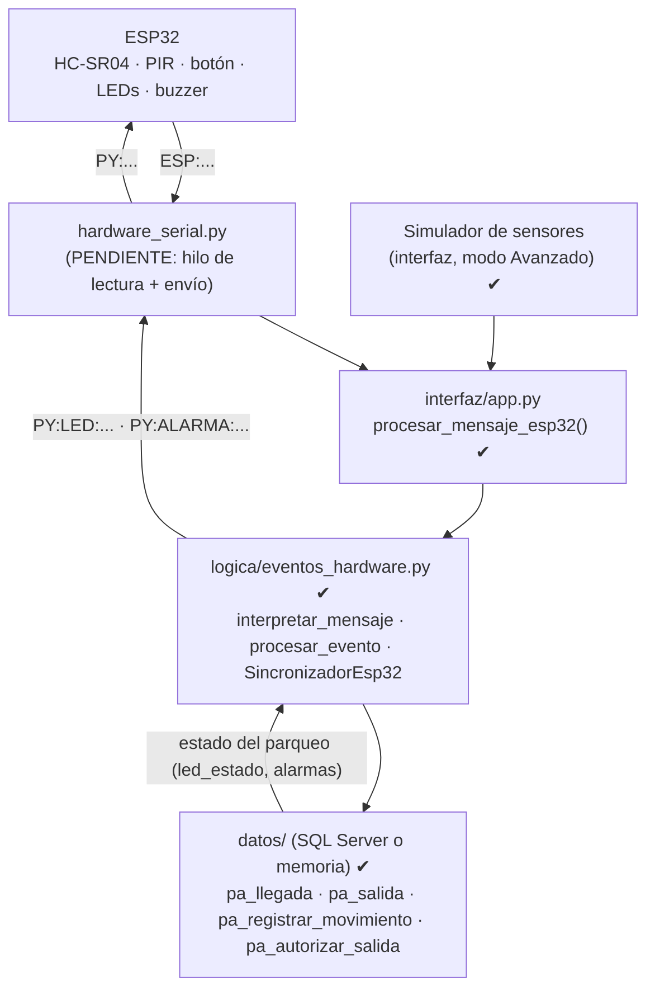
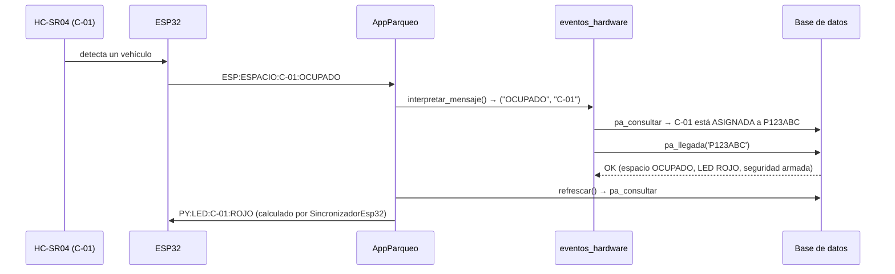
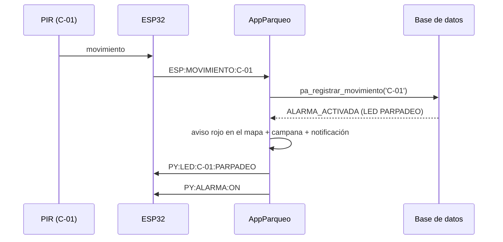
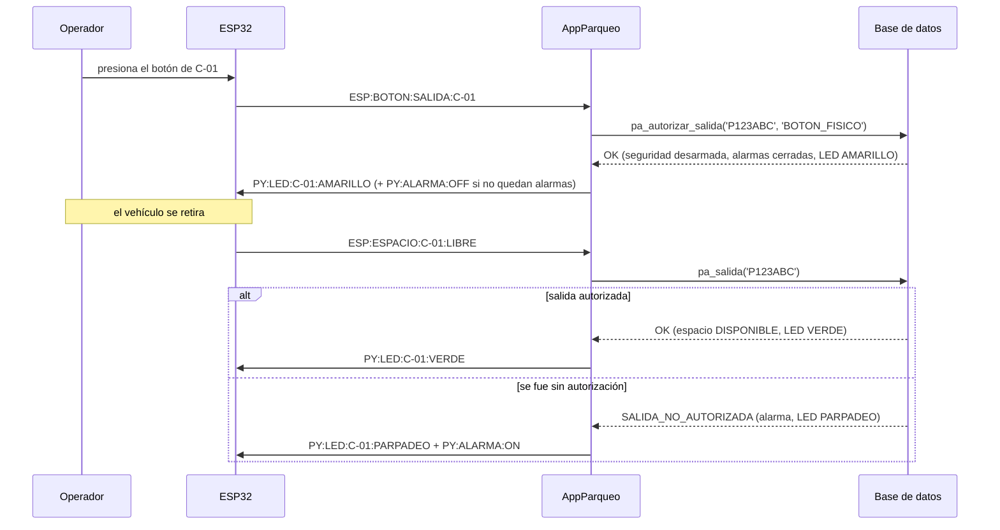

# Plan de arquitectura e integración Hardware-Software (ESP32 ↔ Python)

> **Actualizado tras integrar la base de datos.** La lógica que traduce los
> eventos de los sensores a procedimientos de la base ya está implementada y
> probada (`logica/eventos_hardware.py`), junto con un **Simulador de
> sensores** en el modo Avanzado de la interfaz. Lo único que falta para el
> hardware real es `hardware_serial.py`: leer y escribir el puerto serial.

## 1. Dónde encaja el hardware en el proyecto



Idea clave: un evento de hardware **no inventa lógica nueva**. Llama a los
mismos procedimientos almacenados que usan los botones de la interfaz. La base
decide todo (qué estado sigue, qué color lleva el LED, si suena la alarma), y
Python solo traduce mensajes en una dirección y otra.

El simulador y el ESP32 entran por **la misma puerta**:
`AppParqueo.procesar_mensaje_esp32(linea)`. Todo lo que hoy funciona con el
simulador funcionará igual con el hardware.

## 2. Lo que falta: `hardware_serial.py`

### 2.1 Por qué un hilo aparte

- Tkinter **no es seguro entre hilos** y `pyodbc` tampoco: la conexión a la
  base solo puede usarse desde el hilo principal.
- Leer el puerto de forma bloqueante congelaría la ventana.

Solución: un **hilo secundario** que solo lee líneas del puerto y las deja en
una `queue.Queue`; el hilo de Tkinter las saca con `self.after(...)` y las pasa
a `procesar_mensaje_esp32`. El hilo serial **nunca** toca la base ni la ventana.

### 2.2 Esqueleto propuesto

```python
"""hardware_serial.py — comunicación con el ESP32 por USB/Serial."""

import queue
import threading

import serial       # pip install pyserial

BAUDIOS = 115200


def conectar_hardware(puerto):
    """Abre el puerto y arranca el hilo de lectura."""
    conexion = serial.Serial(puerto, BAUDIOS, timeout=1)
    cola = queue.Queue()
    threading.Thread(target=_leer_en_bucle, args=(conexion, cola), daemon=True).start()
    return {"puerto": conexion, "cola": cola}


def _leer_en_bucle(puerto, cola):
    """Hilo secundario: solo encola líneas, nunca toca la base ni la interfaz."""
    while puerto.is_open:
        try:
            linea = puerto.readline().decode("utf-8", errors="ignore").strip()
        except serial.SerialException:
            break
        if linea:
            cola.put(linea)


def mensajes_pendientes(conexion_hw):
    """Desde el hilo de Tkinter: devuelve lo que llegó (nunca bloquea)."""
    mensajes = []
    while not conexion_hw["cola"].empty():
        mensajes.append(conexion_hw["cola"].get_nowait())
    return mensajes


def enviar(conexion_hw, comando):
    conexion_hw["puerto"].write((comando + "\n").encode("utf-8"))
```

### 2.3 Los dos puntos de conexión con la aplicación (ya preparados)

1. **ESP32 → aplicación.** En `AppParqueo`, un ciclo con `after()`:

   ```python
   def _revisar_serial(self):
       for linea in hardware_serial.mensajes_pendientes(self.conexion_hw):
           self.procesar_mensaje_esp32(linea)      # ya existe
       self.after(100, self._revisar_serial)
   ```

2. **Aplicación → ESP32.** En `AppParqueo.refrescar()` ya existe el ciclo que
   calcula los comandos; hoy los escribe en el registro del simulador y solo
   hay que agregar el envío:

   ```python
   for comando in self.sincronizador.comandos_pendientes(estado):
       self.vista_avanzada.registrar_trafico("← " + comando, "salida")
       hardware_serial.enviar(self.conexion_hw, comando)     # ← línea nueva
   ```

## 3. Protocolo de mensajes (definitivo)

Texto plano separado por `:` y terminado en salto de línea. Es más fácil de
leer con `strtok()` en el ESP32 que JSON y se puede depurar con el Monitor
Serial de Arduino.

### 3.1 ESP32 → Python

| Mensaje | Sensor | Qué hace `procesar_evento()` |
|---|---|---|
| `ESP:ESPACIO:C-01:OCUPADO` | HC-SR04 detecta un vehículo | Si C-01 está `ASIGNADA` → `pa_llegada(placa)`. Si ya estaba ocupado → sin cambios. Si no hay nadie asignado → aviso "ocupación no esperada". |
| `ESP:ESPACIO:C-01:LIBRE` | HC-SR04 deja de detectarlo | Si C-01 está `OCUPADA` o `AUTORIZADA` → `pa_salida(placa)`. Sin autorización la base responde `SALIDA_NO_AUTORIZADA` y activa la alarma. |
| `ESP:MOVIMIENTO:C-01` | PIR detecta movimiento | `pa_registrar_movimiento('C-01')`. Si la seguridad está armada → `ALARMA_ACTIVADA`. |
| `ESP:BOTON:SALIDA:C-01` | Botón físico | Si C-01 está `OCUPADA` → `pa_autorizar_salida(placa, 'BOTON_FISICO')`. |
| `ESP:HEARTBEAT` | — | Solo confirma que el ESP32 sigue conectado. |

Cambio respecto al plan original: el mensaje del PIR lleva el **código del
espacio** (`ESP:MOVIMIENTO:C-01`) y no un número de sensor, porque
`pa_registrar_movimiento` recibe el código del espacio.

**Placas:** los sensores detectan presencia, no placas. Por eso la placa se
busca en el estado del parqueo según el espacio del evento. El flujo es:
el operador registra la placa y se asigna el espacio desde la interfaz; el
sensor confirma la llegada y la salida físicas.

### 3.2 Python → ESP32

| Mensaje | Significado |
|---|---|
| `PY:LED:C-01:<estado>` | Estado del LED del espacio, igual a la columna `espacios.led_estado` |
| `PY:ALARMA:ON` / `PY:ALARMA:OFF` | Buzzer y LED de alarma (encendidos si hay al menos una alarma activa) |

Los 5 estados de LED que define la base y la propuesta para el montaje (un LED
verde y uno rojo por espacio):

| `led_estado` | Cuándo | LED verde | LED rojo |
|---|---|---|---|
| `VERDE` | disponible | encendido | apagado |
| `AMARILLO` | asignado, o salida autorizada | encendido | encendido |
| `ROJO` | ocupado | apagado | encendido |
| `PARPADEO` | alarma en ese espacio | apagado | intermitente |
| `APAGADO` | fuera de servicio | apagado | apagado |

**La base es la única fuente de verdad.** `SincronizadorEsp32` compara el
estado nuevo con lo último enviado y manda solo las diferencias. Si el ESP32
se reinicia, `reiniciar()` hace que se vuelva a mandar todo (en el simulador,
botón "Reenviar estado completo al ESP32").

**Pines:** la columna `espacios.direccion_hw` (`PIN-02`, `PIN-03`...) indica
qué pin corresponde a cada espacio; el firmware del ESP32 debe usar la misma tabla.

## 4. Flujos de control

### 4.1 Llegada de un vehículo asignado



### 4.2 Movimiento con la seguridad armada



### 4.3 Autorización por botón y salida



## 5. Fases de prueba

| Fase | Qué se prueba | Estado |
|---|---|---|
| 0 | Cada componente suelto desde el IDE de Arduino (sin Python) | Equipo de hardware |
| 1 | Serial "eco": el ESP32 manda `ESP:HEARTBEAT` y un script de Python solo imprime | Pendiente |
| 2 | Un sensor real a la vez (HC-SR04, PIR, botón) | Pendiente |
| 3 | Comandos Python → ESP32: un script manda `PY:LED:...` y el LED responde | Pendiente |
| 4 | Bidireccional con 2-3 espacios | Pendiente |
| 5 | Eventos → base de datos | ✔ Hecho con el simulador. Casos EV-01 a EV-07 en `pruebas/prueba_backend.py`, contra SQL Server y contra memoria |
| 6 | Eventos → interfaz en tiempo real | ✔ Hecho con el simulador (`pruebas/prueba_interfaz.py`, casos UI-04 y UI-08) |
| 7 | `hardware_serial.py` conectado a la aplicación (sección 2.3) | Pendiente: es el único código nuevo que falta |
| 8 | Resiliencia: desconectar el USB, reiniciar el ESP32, mensajes corruptos | Pendiente (los mensajes inválidos ya se rechazan sin romper nada) |

Para probar las fases 1 a 4 sin la aplicación completa, el formato de los
mensajes se puede validar con `logica.eventos_hardware.interpretar_mensaje()`
desde un script corto.
